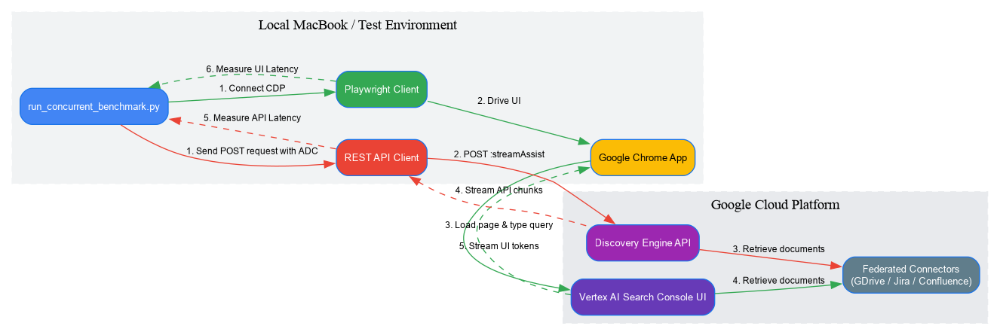

# Gemini Enterprise Latency Benchmarking Harness

This folder contains a complete concurrent benchmarking suite designed to measure and validate Gemini Enterprise latency metrics (TTFT and TTLT) in your Google Cloud environment (**`corp-vertias-d`**), built on top of [Vertex AI Search & Conversation](https://cloud.google.com/generative-ai-app-builder/docs/introduction).

It enables automated, head-to-head performance evaluations of:
1.  **Programmatic `streamAssist` REST API** (intent classifier bypass routing).
2.  **Web App UI Preview Chat** (automated headless browser interactions).

## 📊 Latency Benchmarking Architecture

To evaluate the RAG Search latency profiles across different data connector complexities (Single-Connector vs Multi-Connector Federated RAG), the test harness runs concurrent queries via two distinct pathways.



*(You can view or edit the source definition in the [Graphviz DOT Source](architecture.dot) file.)*

---

## 📋 1. Prerequisites & Environment Prep

Before running the benchmarks, complete these steps on your development workstation:

### A. Authenticate Google Cloud CLI (Matching Profile)
Ensure your active `gcloud` profile and Google Cloud credentials match the target GCP environment:
1. Check your currently active `gcloud` account and project:
   ```bash
   gcloud config list
   ```
2. If the active account or project does not match your target environment, switch them:
   ```bash
   gcloud config set account <your-corp-email>
   gcloud config set project corp-vertias-d
   ```
3. Authorize Google [Application Default Credentials (ADC)](https://cloud.google.com/docs/authentication/provide-credentials-adc) for the Python client library:
   ```bash
   gcloud auth application-default login
   ```

> **⚠️ IMPORTANT: Account Alignment Constraint**  
> The Google account authorized in your terminal must **exactly match** the account you use to log in to the Google Cloud Console (Vertex AI Search) in Chrome. Discrepancies between your CLI authentication and your browser session will lead to benchmark execution failures.

### B. Install Python & Dependency Manager (`uv`)
We use `uv` to automatically bootstrap isolated virtual environments and pin package dependencies. 

> **ℹ️ NOTE: Automated Dependency Management**  
> You do **not** need to manually run `pip install` or set up virtual environments. The benchmark runner script contains inline PEP 723 metadata that instructs `uv` to automatically fetch, install, and cache all required libraries—including `playwright` (browser automation), `matplotlib` (chart generation), and `rich` (beautifully formatted colored terminal reports)—on your very first run.

Run the following command to install `uv` on your development workstation:
```bash
# Install uv locally
curl -LsSf https://astral.sh/uv/install.sh | sh
source $HOME/.local/bin/env
```

### C. Browser Environment (Chrome Profile Selection)

> **⚠️ WARNING: No Pre-opened Browser Assumption**  
> Do **NOT** assume that a Chrome window is already open or authenticated with your target GCP account. You must explicitly verify that:
> 1. A Google Chrome window is active and visible on your desktop.
> 2. You are logged into the correct Google Cloud account in that browser profile.
> 3. If running in CDP mode (`--cdp-url`), Chrome must be explicitly running with remote debugging active and have the Vertex AI Search page open and authenticated.

The UI benchmark runs locally by launching an interactive Chrome window.
1. **Interactive Login Mode (Default)**:  
   When you start the benchmark runner, it will automatically launch a new Chrome browser window and navigate to the Google Cloud Console (Gen App Builder) sign-in page.
   * You **must** log in using the same account configured in Step A (`<your-corp-email>`).
   * If you have multiple Chrome profiles, ensure you are signing in to the profile associated with that email.
2. **CDP Option (Optional / Headless VMs)**:  
   If you are running the test harness on a remote VM, or need to target a specific authenticated Chrome profile when multiple profiles exist, you can connect to an already active local Chrome session instead via [Chrome DevTools Protocol (CDP)](https://chromedevtools.github.io/devtools-protocol/) by launching Chrome with a remote debugging port enabled.

   > **ℹ️ NOTE: Default Profile Constraint / Custom Directories**:  
   > Many environments (including corporate Linux VMs) restrict remote debugging on the default user profile. You must specify either a dedicated debugging profile directory (via `--user-data-dir`) or a specific profile directory (via `--profile-directory`).

   ### Option A: Launch with a dedicated debug profile directory (Recommended for Linux VMs)

   First, navigate to the test harness directory:
   ```bash
   cd tools/gemini-enterprise-slack-agent/tools/test_harness
   ```

   Then, run the appropriate command for your operating system:

   **macOS**:
   ```bash
   /Applications/Google\ Chrome.app/Contents/MacOS/Google\ Chrome --remote-debugging-port=9223 --user-data-dir=$HOME/Library/Application\ Support/Google/Chrome-Debug
   ```

   **Linux (Ubuntu/Debian)**:
   ```bash
   google-chrome --remote-debugging-port=9223 --user-data-dir=$HOME/.config/google-chrome-debug
   ```

   **Windows (Command Prompt)**:
   ```cmd
   "C:\Program Files\Google\Chrome\Application\chrome.exe" --remote-debugging-port=9223 --user-data-dir="%LOCALAPPDATA%\Google\Chrome-Debug"
   ```

   **Windows (PowerShell)**:
   ```powershell
   Start-Process -FilePath "C:\Program Files\Google\Chrome\Application\chrome.exe" -ArgumentList "--remote-debugging-port=9223", "--user-data-dir=$env:LOCALAPPDATA\Google\Chrome-Debug"
   ```

   ### Option B: Launch with a specific existing Chrome Profile
   If you want to reuse an existing profile containing your credentials, you must resolve its directory path:
   1. Open Google Chrome.
   2. Switch to the correct Chrome Profile that is logged in to your target Google Cloud account.
   3. Navigate to `chrome://version/`.
   4. Locate the **Profile Path** row. The folder name at the very end of the path (e.g., `Profile 1` or `Default`) is your profile directory name.
   5. Launch Chrome using `--profile-directory` and `--user-data-dir` (parent directory of your profile path):
      ```bash
      # macOS Example (targeting Profile 1):
      /Applications/Google\ Chrome.app/Contents/MacOS/Google\ Chrome --remote-debugging-port=9223 --user-data-dir="$HOME/Library/Application Support/Google/Chrome" --profile-directory="Profile 1"
      ```

> **💡 TIP: Understanding the Debugging Port & Environment Configurations (`9223`)**  
> * **Arbitrary Port Choice**: The port number **`9223`** was chosen arbitrarily in our examples to avoid port collisions. While Chrome's default remote debugging port is `9222`, that standard port is frequently occupied, blocked, or in use by corporate processes (such as Google Drive on macOS).
> * **Port Matching**: You are free to choose **any available port** on your machine. Just ensure that the port matches exactly across your Chrome launch command (`--remote-debugging-port=<port>`) and your benchmark runner parameter (`--cdp=http://localhost:<port>`).
> * **Choosing Your Execution Environment**:
>   * **Mode A: Local Execution (Native MacBook Run)**: If you are running both Chrome and the test harness script locally on your physical laptop, no network tunneling is needed. Simply launch Chrome with remote debugging on port `9223` and run the benchmark directly pointing to localhost:
>     ```bash
>     uv run src/run_concurrent_benchmark.py --manifest=config/yahoo_environment/manifest_multi_query.json --cdp=http://localhost:9223
>     ```
>   * **Mode B: Remote VM Execution (Remote Linux VM + Local Chrome)**: If you are running the test harness script on a remote headless VM (like a Cloudtop or gLinux VM) but running Chrome on your local MacBook, you must bridge the two environments using an SSH tunnel to forward the DevTools port:
>     1. On your MacBook, launch Chrome on port `9223`.
>     2. Establish the SSH port forwarding tunnel:
>        ```bash
>        ssh -L 9223:localhost:9223 <your-remote-vm-hostname>
>        ```
>     3. Run the benchmark on your remote VM:
>        ```bash
>        uv run src/run_concurrent_benchmark.py --manifest=config/yahoo_environment/manifest_multi_query.json --cdp=http://localhost:9223
>        ```

   > **⚠️ IMPORTANT: CDP Authentication & Google Login Alignment**  
   > When Chrome launches via the remote debugging port, you may be prompted to log in to your Google account in the browser window if you are not already signed in.
   > 
   > You **must** log in using the exact same Google account that is authenticated in your terminal's `gcloud` profile (from Step A). Discrepancies between your CLI auth credentials and the active browser session will lead to benchmark failures, as both the REST API (using ADC) and the Web App UI preview automation must access the same GCP project and Vertex AI Search / Gemini Enterprise agent resources.

---

## 🛠️ 2. Configuration & Parameter Setup

The harness is configured using JSON manifest files.

> **⚠️ IMPORTANT: Yahoo Environment Placeholders**  
> The default manifests in `config/yahoo_environment/` contain the placeholder: **`<YAHOO_VERTEX_SEARCH_ENGINE_ID>`**.
> You **must** replace this placeholder with your actual Yahoo Vertex Search Engine ID before running any tests. If you run the harness with the placeholder, the browser automation will fail to resolve the Configuration ID.

### A. How to Find Your Vertex Search Engine ID
1. Log in to the Google Cloud Console and navigate to the **Vertex AI Search & Conversation** console.
2. Select your project: **`corp-veritas-d`**.
3. In the left navigation menu, click **Engines** or **Apps**.
4. Click on your active agent/search engine.
5. In the browser's address bar, look at the URL. It will have a structure similar to:
   `https://console.cloud.google.com/gemini-enterprise/locations/global/engines/YOUR_ENGINE_ID/overview/dashboard?project=corp-veritas-d`
   The segment immediately following `/engines/` is your **Engine ID**.

### B. Update the Manifest Files
Open both manifest files in the `config/yahoo_environment/` directory and replace `<YAHOO_VERTEX_SEARCH_ENGINE_ID>` with your active Engine ID:
1. **[verify_manifest.json](file:///usr/local/google/home/thomascummins/Dev/projects/engagements/yahoo/tools/gemini-enterprise-slack-agent/tools/test_harness/config/yahoo_environment/verify_manifest.json#L6)**
2. **[manifest_multi_query.json](file:///usr/local/google/home/thomascummins/Dev/projects/engagements/yahoo/tools/gemini-enterprise-slack-agent/tools/test_harness/config/yahoo_environment/manifest_multi_query.json#L6)**

### C. Customized Manifest Schema & Parameters
The benchmark is driven entirely by a JSON manifest. Below is the master schema structure, detailing both the required parameters and optional flags:

```json
{
  "project_id": "corp-veritas-d",              // REQUIRED: The target Google Cloud Project ID hosting the Vertex engine
  "engine_id": "your-active-engine-id",        // REQUIRED: The Vertex AI Search Engine ID
  "model_used": "gemini-3.5-flash",            // REQUIRED: The exact API model name (e.g. "gemini-3.5-flash", "gemini-1.5-pro")
  "iterations": 5,                             // REQUIRED: Number of benchmarking repetitions per scenario (for sample size n)
  "concurrency_limit": 3,                      // REQUIRED: Maximum concurrent workers running tests in parallel
  "quota_project_id": "your-billing-project",  // OPTIONAL: Only needed if billing/quota needs to be routed to a separate project than project_id
  "scenarios": [                               // REQUIRED: The list of evaluation test cases to execute
    {
      "name": "Q1. GDrive - PTO Rollover (Stream)",// REQUIRED: Unique descriptive label for the test scenario
      "api": "streamAssist",                   // REQUIRED: Pathway to test ("streamAssist" for REST API, "ui" for Browser Preview UI)
      "query": "What is the company policy for rollover of unused PTO days?", // REQUIRED: The query text
      "complexity_level": "Level 2: Single-Connector RAG" // OPTIONAL: Descriptive RAG profiling tag
    }
  ]
}
```

#### Parameter Breakdown:
*   **`project_id`**: The target Google Cloud Project hosting your Vertex AI Search engine (e.g., `corp-veritas-d`).
*   **`engine_id`**: The active Engine ID found in your Vertex AI Search console (under Engines).
*   **`model_used`**: The model identifier being evaluated. The harness supports:
    *   **`gemini-3.5-flash`** (Gemini 3.5 Flash)
    *   **`gemini-3.1-pro`** (Gemini 3.1 Pro - mapped internally to the active API ID `gemini-3.1-pro-preview`)
*   **`iterations`**: Number of consecutive runs per scenario. A larger sample size (e.g., `5` or `10`) ensures accurate latency percentiles.
*   **`concurrency_limit`**: Limits the number of tests executed simultaneously, preventing API rate limiting (`429 Resource Exhausted`) during local runs.
*   **`quota_project_id`**: (Optional) Specify only if your GCP user role requires API quotas to be billed to a separate project than the target project. Otherwise, omit or leave blank.

---


## 🚀 3. Executing the Test Harness

To ensure the test harness is properly configured, execute the benchmark in two separate phases:

### Phase 1: Run the Environment Smoke Test
Before executing the full benchmark suite, run a single-iteration smoke test to verify your credentials, browser launching, and report rendering configuration.

> **⚠️ IMPORTANT: Pre-Authenticate in Chrome (Highly Recommended)**  
> To prevent script timeouts and ensure a smooth run, **always manually log in first**:
> 1. In your opened debugging Chrome window, navigate to `https://console.cloud.google.com/gen-app-builder/` and log in to your target Google Cloud account.
> 2. Keep the Vertex AI Search console tab open.
> 
> When you execute the benchmark script, it will instantly detect this active tab, resolve the Configuration ID (CID) in under a second, and proceed to run the scenarios.
> 
> *Note: If you run the script without pre-authenticating, you will be prompted with a Google Account login challenge in a new tab. You must complete the login and 2FA manually within 90 seconds, otherwise the script will time out and fail.*

1. Navigate to the test harness directory:
   ```bash
   cd tools/gemini-enterprise-slack-agent/tools/test_harness
   ```
2. Run the smoke test using your active environment folder (e.g., `yahoo_environment`):
   ```bash
   # NATIVE LOCAL RUN (Interactive Mode)
   uv run src/run_concurrent_benchmark.py --manifest=config/yahoo_environment/verify_manifest.json

   # REMOTE VM RUN (CDP Mode - connects to your active browser window)
   uv run src/run_concurrent_benchmark.py \
     --manifest=config/yahoo_environment/verify_manifest.json \
     --cdp=http://localhost:9223
   ```

#### 🛡️ Expected Smoke Test Results:
* **Terminal output**:
  ```text
  Loading configuration manifest: config/yahoo_environment/verify_manifest.json
  Initialized local execution folder: runs/run_20260617_185229_verify
  Resolving credentials...
  Initializing Playwright browser context...
  Authentication successful! Detected Configuration ID: c33a03fe-9fbc-4ce7-ad44-85195fbe5625
  Scheduling concurrent runs for scenario: Q1. GDrive - PTO Rollover (Stream)...
  Scheduling concurrent runs for scenario: Q1. GDrive - PTO Rollover (UI)...
  Generated unified latency comparison chart at: runs/run_20260617_185229_verify/charts/combined_latency_comparison.png
  All runs artifacts written successfully to: runs/run_20260617_185229_verify
  ```
* **Generated Assets**:
  A timestamped folder `runs/run_<timestamp>_verify/` containing:
  - `report.md`: Master Markdown report summary.
  - `results.json`: Raw execution metrics and API details.
  - `charts/`: Comparative grouped bar charts and bin-distribution graphs.
  - `screenshots/`: Snapshots of the browser UI interactions during execution.

---

### Phase 2: Run the Full Latency Benchmarking Testing
Once the smoke test completes successfully, you are ready to kick off the full benchmarking execution.

1. Execute the full benchmarking testing manifest:
   ```bash
   # NATIVE LOCAL RUN (Interactive Mode)
   uv run src/run_concurrent_benchmark.py --manifest=config/yahoo_environment/manifest_multi_query.json

   # REMOTE VM RUN (CDP Mode)
   uv run src/run_concurrent_benchmark.py \
     --manifest=config/yahoo_environment/manifest_multi_query.json \
     --cdp=http://localhost:9223
   ```
2. This runs **5 iterations** across **9 unique scenarios** for both REST API and Web UI (90 total requests). It may take 10 to 15 minutes to complete depending on network conditions.
3. The results will be aggregated inside a master report at `runs/run_<timestamp>_002/report.md`.

---

## ❓ 4. FAQs & Troubleshooting

### Q1: I get `browser_type.launch: Display not found. Are you running in a headless environment?`
* **Why this happens**: You are running the benchmark on a remote Linux server/VM which lacks a physical monitor display, but the script is attempting to launch a headful GUI Chrome window.
* **How to fix**: 
  - **Local machine execution**: Run the script natively on your macOS/Windows laptop.
  - **CDP mode fallback**: Start Chrome on your machine with remote debugging active, forward that port to the VM, and append the `--cdp-url` argument to your run command.

### Q2: The script hangs or fails with `ERROR: Authentication timed out or Configuration ID not detected`
* **Why this happens**: The interactive browser window popped up, but login was not completed within the 60-second window, or the browser profile did not match your terminal's `gcloud` context.
* **How to fix**:
  1. Verify your CLI configuration by running `gcloud config list` and `gcloud auth list`. Ensure the active account matches the email profile you use in the browser.
  2. Start the script again, and immediately log in to the Vertex AI console once the Chrome tab opens.

### Q3: I get `ModuleNotFoundError: No module named 'src'`
* **Why this happens**: The script was executed from outside the project directory, or with an incorrect path context.
* **How to fix**: Ensure you are executing the command `uv run src/run_concurrent_benchmark.py` directly from the `tools/gemini-enterprise-slack-agent/tools/test_harness` root directory. The `pyproject.toml` file natively configures the workspace and environment pathing.

### Q4: Scenario tasks fail with `PermissionDenied` or `403` status codes
* **Why this happens**: Your Google account lacks access rights to the Vertex AI Search engine, or the IDs configured in your manifest do not exist.
* **How to fix**:
  1. Open the Vertex AI Search console in Chrome and check that you can query the datastores manually.
  2. Verify that `project_id`, `engine_id`, and `sub_agent_id` configured in your manifest folder (e.g., `yahoo_environment/manifest_multi_query.json`) match the values shown in the console URL.

---

## 📊 5. Interpreting Output Reports

All results, logs, chart distributions, and visual validation snapshots are written to a unique timestamped folder under `runs/run_<timestamp>/`:

### A. The Master Markdown Report (`report.md`)
This report aggregates the benchmark run details:
*   **Run Execution Metadata**: Displays active execution parameters:
    *   **Concurrency Limit**: Total number of simultaneous workers.
    *   **Total Duration**: Wall-clock execution time.
    *   **Average Throughput**: Total queries divided by duration, representing average queries per minute (QPM) submitted to the API.
*   **Query Complexity Profiling**: Each test scenario is tagged with a Complexity Level:
    *   *Level 1*: Intrinsic Knowledge / Grounding Bypassed (e.g. hello, greetings).
    *   *Level 2*: Single-Connector RAG (searching a single index).
    *   *Level 3*: Multi-Connector Federated RAG (searching 2–3 active indexes).
    *   *Level 4*: Custom Agent Tooling / Reasoning (orchestrator routing).
*   **Unified Latency Comparison Chart**: Grouped bar chart comparing TTFT and TTLT (with error range bars) for all scenarios.
*   **Performance Scale Tables**: Displays detailed lists of status codes, TTFT, TTLT, characters per second, and Google Cloud Console Trace Links for every run.

### B. Standard Metrics Focus
Following Google's internal latency playbook guidelines, performance validation is analyzed using **Percentile Distributions (P50, P90, P95, P99)** rather than raw averages:
*   **P50 (Median)**: Represents typical user experience.
*   **P90 / P95 (General Trend)**: Standard benchmark metrics for identifying general latency trends while ignoring network spikes.
*   **P99 (Worst Case)**: Identifies tail latency, slow cold starts, and rare freezes.
*   **Min / Max / Avg**: Included as fallback boundaries to highlight raw scaling limits.

### C. Distributed Cloud Tracing & RAG Observability

For programmatic REST API invocations (e.g., `streamAssist` and `assist` endpoints), the test harness automatically injects distributed tracing headers. This enables deep, server-side execution timeline diagnostics (such as RAG document retrieval latency vs. LLM token generation latency). For more details, see the official guide to **[Access Gemini Enterprise Traces and Spans](https://docs.cloud.google.com/gemini/enterprise/docs/access-traces-and-spans)**.

#### 1. How Traces are Captured & Propagated:
To ensure 100% trace capture across legacy Google API gateways and modern OpenTelemetry backends, the test harness automatically generates a unique 128-bit trace ID (32-char hex) and a random 64-bit Span ID (16-char hex), and injects **BOTH** of the following headers into the outgoing API request:
*   **W3C Trace Context (OpenTelemetry Standard):**
    ```http
    traceparent: 00-<trace_id>-<span_id_hex>-01
    ```
    *(Where `01` is the sampling flag instructing the OpenTelemetry backend to force-sample and record the trace).*
*   **Google Cloud Trace Context (Legacy Gateway):**
    ```http
    x-cloud-trace-context: <trace_id>/<span_id_decimal>;o=1
    ```

#### 2. How Traces are Displayed in the Report:
To accommodate the Google Cloud Console's new **Trace Explorer** interface (which strips query string parameters during redirects), the report displays trace information in a clear, highly copyable tabular format:
*   **Base Trace Explorer URL:** The report and console outputs point to the project's base Trace Explorer panel:
    `https://console.cloud.google.com/traces/explorer?project=<project_id>`
*   **Trace ID Column:** Contains the raw 32-character hexadecimal Trace ID in a copyable code block:
    `85208b5e4b9445e6964290dfb86e98a4`
*   **Span ID Column:** Contains the raw 16-character client-side root Span ID in a copyable code block:
    `71d72dc199e1a255`

#### 3. How to Review a Specific Trace in the Cloud Console:
1.  **Copy the Trace ID** from the **Trace ID** column in the report.
2.  **Open the Base Trace Explorer URL** provided in the report.
3.  In the top-right toolbar of the Trace Explorer page, click the **`Trace ID`** button (represented by a key/magnifying glass icon).
4.  **Paste the copied Trace ID** into the search box that appears and press **Enter**.
5.  **BAM!** The Trace Explorer will instantly load and display the detailed **Trace Details flyout** on the right side of your screen, showing the exact waterfall graph and timeline of only our RAG spans (the StreamAssist root, orchestrator invocations, search retrievals, and model generations)!

#### 4. Querying Traces Programmatically via SQL (Observability Analytics):
If you want to perform aggregate analysis, trace-to-log correlations, or retrieve spans programmatically, you can run SQL queries directly inside **Observability Analytics** (GCP Log Analytics):

1. Click the **`Query in SQL`** button in the Trace Explorer toolbar, or navigate to **Logging > Observability Analytics** in the Cloud Console.
2. In the SQL editor, paste the following query:
   ```sql
   SELECT 
     span_id,
     parent_span_id,
     name,
     start_time,
     end_time,
     TIMESTAMP_DIFF(end_time, start_time, MILLISECOND) AS duration_ms,
     attributes
   FROM 
     `[PROJECT_ID].us._Trace.Spans._AllSpans`
   WHERE 
     trace_id = 'YOUR_TRACE_ID_HERE'
   ORDER BY 
     start_time ASC;
   ```
   *(Be sure to replace `[PROJECT_ID]` with your active GCP project, e.g. `corp-veritas-d`, and replace `'YOUR_TRACE_ID_HERE'` with the target Trace ID from the report).*
3. **CRITICAL TIME WINDOW FILTER:** Before running the query, check the time filter dropdown in the top-right corner of the query editor (e.g. next to the "Run query" button). By default, it is set to **`Last 1 hour`**. If your test was executed earlier, change this filter to **`Last 4 hours`** or **`Last 1 day`**, otherwise the query will return 0 results.
4. Click **`Run query`** to display your trace's chronological spans, nested durations, and OpenTelemetry metadata in a structured table.

> **⚠️ IMPORTANT: Why Traces are API-Only (Not UI)**  
> Since the Web App UI preview tests simulate user clicks in an automated, headless browser session interacting directly with the pre-hosted Google Cloud Console page, the harness cannot intercept or inject custom HTTP headers into those page requests. Therefore, Trace and Span IDs are marked as `N/A` for UI scenarios. Instead, the harness captures full-screen **visual screenshots** at key interaction points to validate rendering and client-state correctness.

---

## 📂 6. Folder Directory Map
*   `src/run_concurrent_benchmark.py`: Main concurrent worker harness script.
*   `src/browser_controller.py`: Playwright POM controller encapsulating shadow DOM page logic.
*   `src/chart_generator.py`: Plotting utility generating latency bar charts and distribution timelines.
*   `config/`: Configuration JSON files mapping connected data connector test cases.
*   `docs/multi_query_benchmark_reference.md`: A reference output report compiling baseline metrics.
