# Latency Audit Report: Test Run 002
Executed at: `2026-06-17T17:33:19Z` using manifest: `reproduction_kit/manifests/manifest_002_multi_query.json`

## 📊 Unified Latency Comparison (TTFT vs. TTLT)

---

## Scenario: Q1. GDrive - PTO Rollover (Stream)
| Run ID | API Used | status_code | TTFT (s) | TTLT (s) | Speed (char/s) | Trace & Screenshot |
| :--- | :--- | :--- | :--- | :--- | :--- | :--- |
| 1 | streamAssist | 200 | 6.001 | 16.265 | 32.5 | [Trace Link](https://console.cloud.google.com/traces/list?project=genai-alpha-422116&tid=ec1a8205b1ef47dcbd41b0dbd73041e9) |
| 2 | streamAssist | 200 | 9.494 | 20.785 | 46.7 | [Trace Link](https://console.cloud.google.com/traces/list?project=genai-alpha-422116&tid=5821f1c9799b437395421fe9011ee5bf) |
| 3 | streamAssist | 200 | 9.511 | 19.213 | 31.2 | [Trace Link](https://console.cloud.google.com/traces/list?project=genai-alpha-422116&tid=656506f98ae64810b935473f45a6a762) |
| 4 | streamAssist | 200 | 6.853 | 17.207 | 29.2 | [Trace Link](https://console.cloud.google.com/traces/list?project=genai-alpha-422116&tid=79057eef30cc42ad9d29e2424e6f5fbf) |
| 5 | streamAssist | 200 | 8.304 | 18.200 | 47.0 | [Trace Link](https://console.cloud.google.com/traces/list?project=genai-alpha-422116&tid=7f8df3736c84431a9d6eabdd566b0e1b) |
| 6 | streamAssist | 200 | 8.940 | 19.448 | 28.2 | [Trace Link](https://console.cloud.google.com/traces/list?project=genai-alpha-422116&tid=ba1a7d8c7ea443c890d2519655c9feeb) |
| 7 | streamAssist | 200 | 7.468 | 18.412 | 50.1 | [Trace Link](https://console.cloud.google.com/traces/list?project=genai-alpha-422116&tid=50aec0561e514e5d8e6473b5a00645ce) |
| 8 | streamAssist | 200 | 8.155 | 18.929 | 39.3 | [Trace Link](https://console.cloud.google.com/traces/list?project=genai-alpha-422116&tid=fb096a1e6a904d92944842f7ca54ec5d) |
| 9 | streamAssist | 200 | 7.058 | 16.367 | 34.4 | [Trace Link](https://console.cloud.google.com/traces/list?project=genai-alpha-422116&tid=bef058b9d3dc470face4c0ee2fd08a63) |
| 10 | streamAssist | 200 | 7.857 | 28.203 | 23.6 | [Trace Link](https://console.cloud.google.com/traces/list?project=genai-alpha-422116&tid=48bd6b947d7f4128ab671f54ee0e87f2) |

**Statistics for Q1. GDrive - PTO Rollover (Stream):**
* **Success Rate**: 100.0%
* **TTFT**: Min = 6.001 s, Max = 9.511 s, Avg = 7.964 s, P90 = 9.511 s
* **TTLT**: Min = 16.265 s, Max = 28.203 s, Avg = 19.303 s, P90 = 28.203 s
* **Speed**: Min = 23.591 char/s, Max = 50.072 char/s, Avg = 36.207 char/s, P90 = 50.072 char/s

### 📈 Latency Visualizations

**Latency Across Runs (TTFT vs TTLT)**:

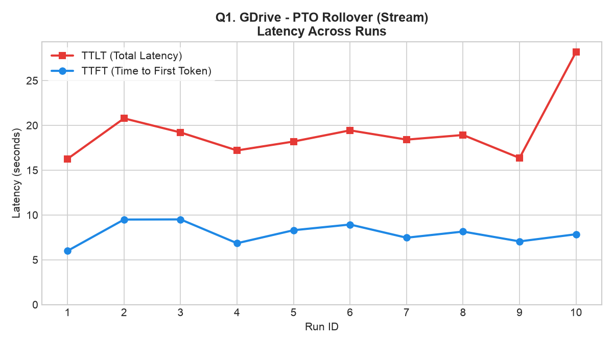

**Latency Bin Distribution**:

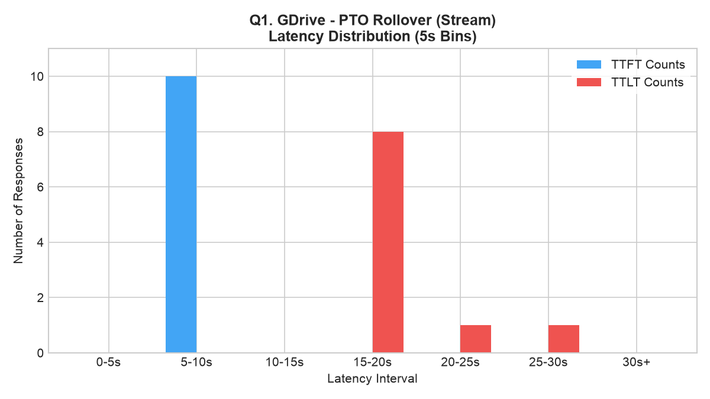

## Scenario: Q1. GDrive - PTO Rollover (UI)
| Run ID | API Used | status_code | TTFT (s) | TTLT (s) | Speed (char/s) | Trace & Screenshot |
| :--- | :--- | :--- | :--- | :--- | :--- | :--- |
| 1 | ui (CDP) | 200 | 19.530 | 20.568 | 188.8 | N/A \| [Screenshot](screenshots/ui_run_1.png) |
| 2 | ui (CDP) | 200 | 23.636 | 24.866 | 270.7 | N/A \| [Screenshot](screenshots/ui_run_2.png) |
| 3 | ui (CDP) | 200 | 18.284 | 18.892 | 530.9 | N/A \| [Screenshot](screenshots/ui_run_3.png) |
| 4 | ui (CDP) | 200 | 18.310 | 19.020 | 368.7 | N/A \| [Screenshot](screenshots/ui_run_4.png) |
| 5 | ui (CDP) | 200 | 38.896 | 39.396 | 355.8 | N/A \| [Screenshot](screenshots/ui_run_5.png) |
| 6 | ui (CDP) | 200 | 39.172 | 40.768 | 102.1 | N/A \| [Screenshot](screenshots/ui_run_6.png) |
| 7 | ui (CDP) | 200 | 17.373 | 17.977 | 340.8 | N/A \| [Screenshot](screenshots/ui_run_7.png) |
| 8 | ui (CDP) | 200 | 18.802 | 19.274 | 582.8 | N/A \| [Screenshot](screenshots/ui_run_8.png) |
| 9 | ui (CDP) | 200 | 25.279 | 25.813 | 331.5 | N/A \| [Screenshot](screenshots/ui_run_9.png) |
| 10 | ui (CDP) | 200 | 18.413 | 19.026 | 326.2 | N/A \| [Screenshot](screenshots/ui_run_10.png) |

**Statistics for Q1. GDrive - PTO Rollover (UI):**
* **Success Rate**: 100.0%
* **TTFT**: Min = 17.373 s, Max = 39.172 s, Avg = 23.769 s, P90 = 39.172 s
* **TTLT**: Min = 17.977 s, Max = 40.768 s, Avg = 24.560 s, P90 = 40.768 s
* **Speed**: Min = 102.137 char/s, Max = 582.751 char/s, Avg = 339.821 char/s, P90 = 582.751 char/s

### 📈 Latency Visualizations

**Latency Across Runs (TTFT vs TTLT)**:

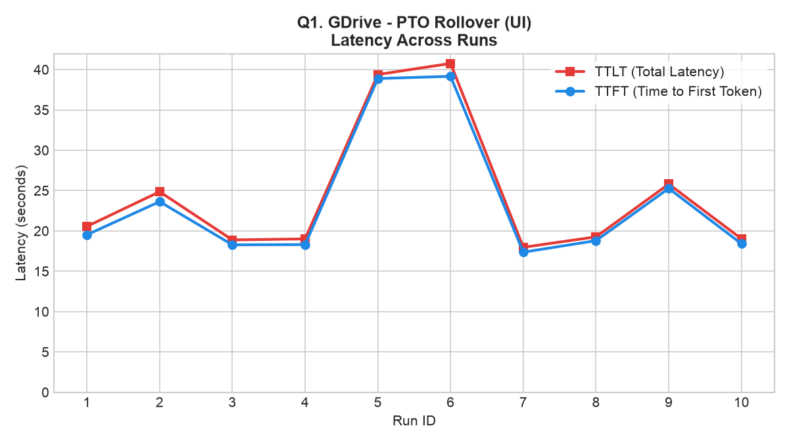

**Latency Bin Distribution**:

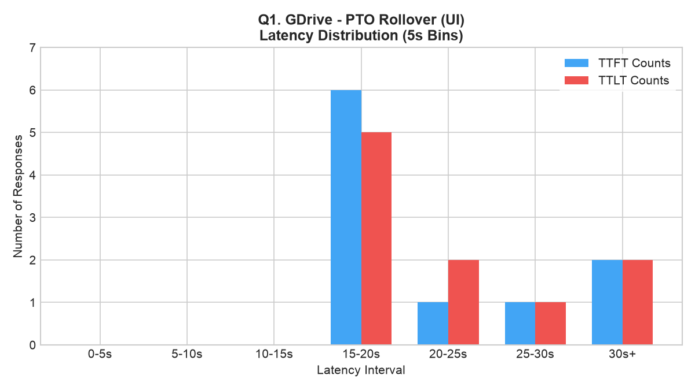

## Scenario: Q2. Confluence - VPN Configuration (Stream)
| Run ID | API Used | status_code | TTFT (s) | TTLT (s) | Speed (char/s) | Trace & Screenshot |
| :--- | :--- | :--- | :--- | :--- | :--- | :--- |
| 1 | streamAssist | 200 | 6.813 | 21.713 | 46.5 | [Trace Link](https://console.cloud.google.com/traces/list?project=genai-alpha-422116&tid=80f13e47ae024f268f8c281c4217ed3b) |
| 2 | streamAssist | 200 | 7.495 | 22.745 | 44.5 | [Trace Link](https://console.cloud.google.com/traces/list?project=genai-alpha-422116&tid=ecf45c49269845159c0170e56e2fe6a5) |
| 3 | streamAssist | 200 | 8.033 | 30.341 | 30.6 | [Trace Link](https://console.cloud.google.com/traces/list?project=genai-alpha-422116&tid=c7dc3747cd414752bdc87a21a089f6db) |
| 4 | streamAssist | 200 | 7.245 | 18.885 | 58.2 | [Trace Link](https://console.cloud.google.com/traces/list?project=genai-alpha-422116&tid=e0aede469cef4ddc8288295405b4ad58) |
| 5 | streamAssist | 200 | 9.368 | 23.698 | 71.8 | [Trace Link](https://console.cloud.google.com/traces/list?project=genai-alpha-422116&tid=f6839be499ee4ea2b7cbb4c0d58b6545) |
| 6 | streamAssist | 200 | 6.882 | 20.172 | 49.7 | [Trace Link](https://console.cloud.google.com/traces/list?project=genai-alpha-422116&tid=8f1e5d0e22e648a8bb0975486cb79fab) |
| 7 | streamAssist | 200 | 7.624 | 20.375 | 54.3 | [Trace Link](https://console.cloud.google.com/traces/list?project=genai-alpha-422116&tid=afb27136bfed408fa940a38f94a77106) |
| 8 | streamAssist | 200 | 7.489 | 22.921 | 51.9 | [Trace Link](https://console.cloud.google.com/traces/list?project=genai-alpha-422116&tid=ee06502dc9c44824aa37b80ed05e578d) |
| 9 | streamAssist | 200 | 7.312 | 25.063 | 53.6 | [Trace Link](https://console.cloud.google.com/traces/list?project=genai-alpha-422116&tid=2fbea47540b34dbda7073f83a8ca3ca1) |
| 10 | streamAssist | 200 | 10.123 | 32.110 | 45.7 | [Trace Link](https://console.cloud.google.com/traces/list?project=genai-alpha-422116&tid=024cc2a9ce9e4183ad372a7078d09816) |

**Statistics for Q2. Confluence - VPN Configuration (Stream):**
* **Success Rate**: 100.0%
* **TTFT**: Min = 6.813 s, Max = 10.123 s, Avg = 7.838 s, P90 = 10.123 s
* **TTLT**: Min = 18.885 s, Max = 32.110 s, Avg = 23.802 s, P90 = 32.110 s
* **Speed**: Min = 30.617 char/s, Max = 71.811 char/s, Avg = 50.677 char/s, P90 = 71.811 char/s

### 📈 Latency Visualizations

**Latency Across Runs (TTFT vs TTLT)**:

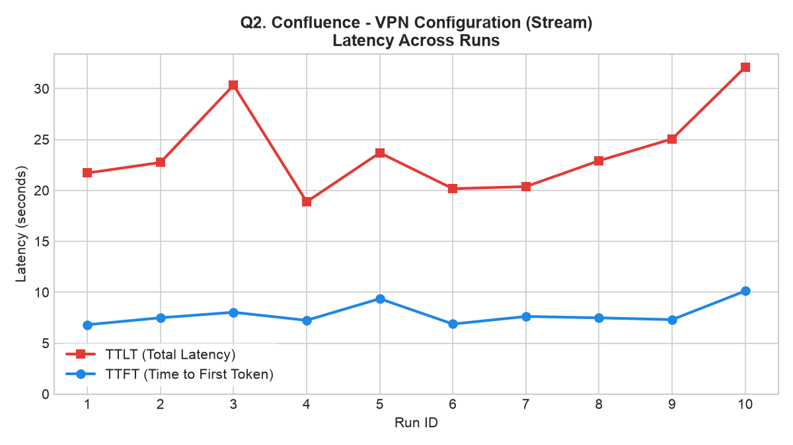

**Latency Bin Distribution**:

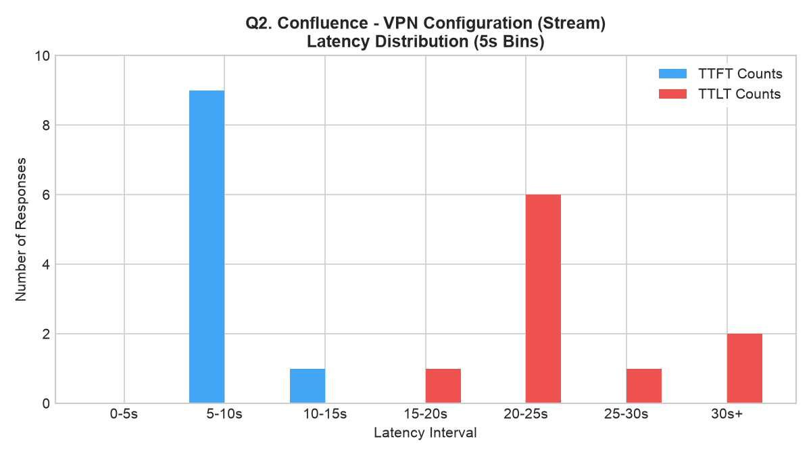

## Scenario: Q2. Confluence - VPN Configuration (UI)
| Run ID | API Used | status_code | TTFT (s) | TTLT (s) | Speed (char/s) | Trace & Screenshot |
| :--- | :--- | :--- | :--- | :--- | :--- | :--- |
| 1 | ui (CDP) | 200 | 31.132 | 33.148 | 475.6 | N/A \| [Screenshot](screenshots/ui_run_1.png) |
| 2 | ui (CDP) | 200 | 29.633 | 31.295 | 509.5 | N/A \| [Screenshot](screenshots/ui_run_2.png) |
| 3 | ui (CDP) | 200 | 22.530 | 23.996 | 556.0 | N/A \| [Screenshot](screenshots/ui_run_3.png) |
| 4 | ui (CDP) | 200 | 23.051 | 24.065 | 385.4 | N/A \| [Screenshot](screenshots/ui_run_4.png) |
| 5 | ui (CDP) | 200 | 22.312 | 24.692 | 274.8 | N/A \| [Screenshot](screenshots/ui_run_5.png) |
| 6 | ui (CDP) | 200 | 22.071 | 24.349 | 374.9 | N/A \| [Screenshot](screenshots/ui_run_6.png) |
| 7 | ui (CDP) | 200 | 23.078 | 23.728 | 509.2 | N/A \| [Screenshot](screenshots/ui_run_7.png) |
| 8 | ui (CDP) | 200 | 20.214 | 21.535 | 392.9 | N/A \| [Screenshot](screenshots/ui_run_8.png) |
| 9 | ui (CDP) | 200 | 30.300 | 31.786 | 335.8 | N/A \| [Screenshot](screenshots/ui_run_9.png) |
| 10 | ui (CDP) | 200 | 22.030 | 23.326 | 523.0 | N/A \| [Screenshot](screenshots/ui_run_10.png) |

**Statistics for Q2. Confluence - VPN Configuration (UI):**
* **Success Rate**: 100.0%
* **TTFT**: Min = 20.214 s, Max = 31.132 s, Avg = 24.635 s, P90 = 31.132 s
* **TTLT**: Min = 21.535 s, Max = 33.148 s, Avg = 26.192 s, P90 = 33.148 s
* **Speed**: Min = 274.790 char/s, Max = 555.972 char/s, Avg = 433.699 char/s, P90 = 555.972 char/s

### 📈 Latency Visualizations

**Latency Across Runs (TTFT vs TTLT)**:

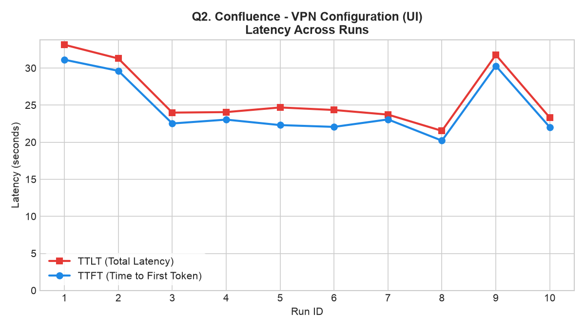

**Latency Bin Distribution**:

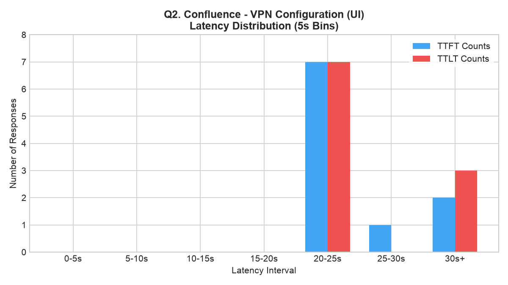

## Scenario: Q3. Jira - Broken Keyboard Status (Stream)
| Run ID | API Used | status_code | TTFT (s) | TTLT (s) | Speed (char/s) | Trace & Screenshot |
| :--- | :--- | :--- | :--- | :--- | :--- | :--- |
| 1 | streamAssist | 200 | 7.709 | 15.960 | 67.3 | [Trace Link](https://console.cloud.google.com/traces/list?project=genai-alpha-422116&tid=181728e011f14bec9cb7b172e54b9eb8) |
| 2 | streamAssist | 200 | 6.144 | 16.569 | 64.1 | [Trace Link](https://console.cloud.google.com/traces/list?project=genai-alpha-422116&tid=5d0a0b19fdd143a6bef1eba48004b5ac) |
| 3 | streamAssist | 200 | 6.713 | 13.007 | 91.2 | [Trace Link](https://console.cloud.google.com/traces/list?project=genai-alpha-422116&tid=95bb7159a98d4421acd5eb24f5f4f1ba) |
| 4 | streamAssist | 200 | 8.942 | 17.206 | 64.3 | [Trace Link](https://console.cloud.google.com/traces/list?project=genai-alpha-422116&tid=e3eb990b961b4a4490da49f6cd7d5e18) |
| 5 | streamAssist | 200 | 6.019 | 14.938 | 64.8 | [Trace Link](https://console.cloud.google.com/traces/list?project=genai-alpha-422116&tid=f1b69f01fb0243f7882c2db9dbc7af89) |
| 6 | streamAssist | 200 | 8.475 | 17.765 | 64.8 | [Trace Link](https://console.cloud.google.com/traces/list?project=genai-alpha-422116&tid=ac5a1f751dec4a63ad5d7881b5736d23) |
| 7 | streamAssist | 200 | 7.355 | 26.064 | 27.8 | [Trace Link](https://console.cloud.google.com/traces/list?project=genai-alpha-422116&tid=69cd5cd9aadc4fb3adcb0698f2179377) |
| 8 | streamAssist | 200 | 7.573 | 18.176 | 61.2 | [Trace Link](https://console.cloud.google.com/traces/list?project=genai-alpha-422116&tid=045e733c414840139b89ed6ca2e67adc) |
| 9 | streamAssist | 200 | 7.874 | 21.471 | 40.3 | [Trace Link](https://console.cloud.google.com/traces/list?project=genai-alpha-422116&tid=b496437bbd8b46efa992ff52b0e00032) |
| 10 | streamAssist | 200 | 10.301 | 19.291 | 67.1 | [Trace Link](https://console.cloud.google.com/traces/list?project=genai-alpha-422116&tid=b928a18f5d254dcf9c22f9e4c138b0e7) |

**Statistics for Q3. Jira - Broken Keyboard Status (Stream):**
* **Success Rate**: 100.0%
* **TTFT**: Min = 6.019 s, Max = 10.301 s, Avg = 7.711 s, P90 = 10.301 s
* **TTLT**: Min = 13.007 s, Max = 26.064 s, Avg = 18.045 s, P90 = 26.064 s
* **Speed**: Min = 27.847 char/s, Max = 91.207 char/s, Avg = 61.285 char/s, P90 = 91.207 char/s

### 📈 Latency Visualizations

**Latency Across Runs (TTFT vs TTLT)**:

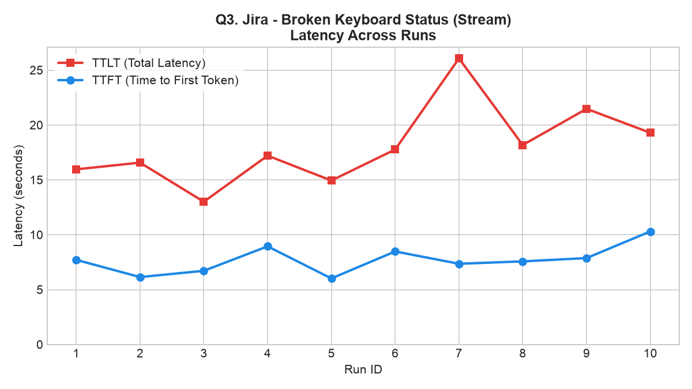

**Latency Bin Distribution**:

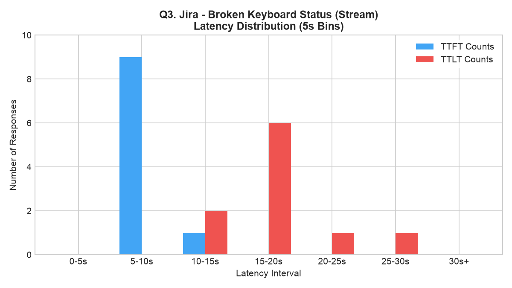

## Scenario: Q3. Jira - Broken Keyboard Status (UI)
| Run ID | API Used | status_code | TTFT (s) | TTLT (s) | Speed (char/s) | Trace & Screenshot |
| :--- | :--- | :--- | :--- | :--- | :--- | :--- |
| 1 | ui (CDP) | 200 | 15.668 | 16.873 | 291.3 | N/A \| [Screenshot](screenshots/ui_run_1.png) |
| 2 | ui (CDP) | 200 | 16.951 | 18.561 | 229.9 | N/A \| [Screenshot](screenshots/ui_run_2.png) |
| 3 | ui (CDP) | 200 | 16.099 | 17.364 | 305.0 | N/A \| [Screenshot](screenshots/ui_run_3.png) |
| 4 | ui (CDP) | 200 | 17.404 | 18.199 | 255.2 | N/A \| [Screenshot](screenshots/ui_run_4.png) |
| 5 | ui (CDP) | 200 | 14.223 | 15.342 | 335.9 | N/A \| [Screenshot](screenshots/ui_run_5.png) |
| 6 | ui (CDP) | 200 | 13.128 | 14.387 | 314.6 | N/A \| [Screenshot](screenshots/ui_run_6.png) |
| 7 | ui (CDP) | 200 | 20.368 | 23.238 | 136.2 | N/A \| [Screenshot](screenshots/ui_run_7.png) |
| 8 | ui (CDP) | 200 | 14.755 | 16.410 | 245.4 | N/A \| [Screenshot](screenshots/ui_run_8.png) |
| 9 | ui (CDP) | 200 | 15.910 | 18.139 | 170.5 | N/A \| [Screenshot](screenshots/ui_run_9.png) |
| 10 | ui (CDP) | 200 | 25.244 | 26.323 | 363.1 | N/A \| [Screenshot](screenshots/ui_run_10.png) |

**Statistics for Q3. Jira - Broken Keyboard Status (UI):**
* **Success Rate**: 100.0%
* **TTFT**: Min = 13.128 s, Max = 25.244 s, Avg = 16.975 s, P90 = 25.244 s
* **TTLT**: Min = 14.387 s, Max = 26.323 s, Avg = 18.484 s, P90 = 26.323 s
* **Speed**: Min = 136.227 char/s, Max = 363.131 char/s, Avg = 264.707 char/s, P90 = 363.131 char/s

### 📈 Latency Visualizations

**Latency Across Runs (TTFT vs TTLT)**:

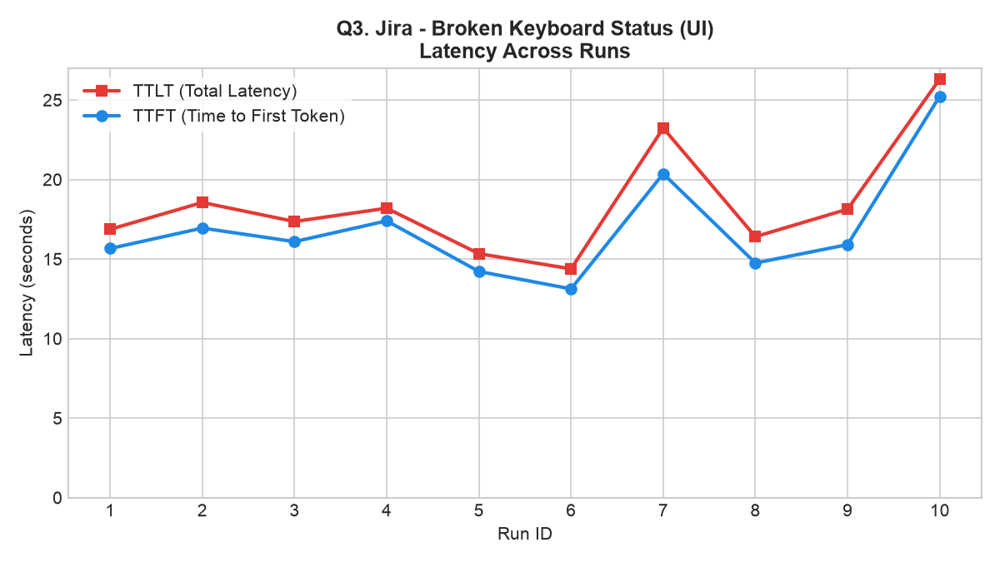

**Latency Bin Distribution**:

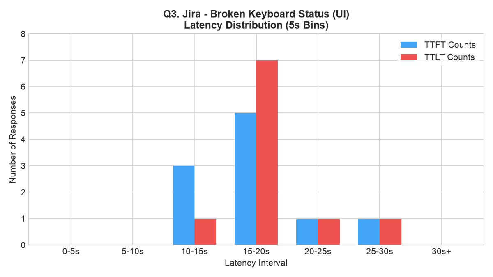

## Scenario: Q4. LumApps GCS - Rollout Latency (Stream)
| Run ID | API Used | status_code | TTFT (s) | TTLT (s) | Speed (char/s) | Trace & Screenshot |
| :--- | :--- | :--- | :--- | :--- | :--- | :--- |
| 1 | streamAssist | 200 | 9.474 | 20.158 | 33.3 | [Trace Link](https://console.cloud.google.com/traces/list?project=genai-alpha-422116&tid=a12f62da2bf5460ba237adb0b2ac72dd) |
| 2 | streamAssist | 200 | 6.213 | 16.482 | 30.9 | [Trace Link](https://console.cloud.google.com/traces/list?project=genai-alpha-422116&tid=d1edd51d2b264629ba72a03e89988cfd) |
| 3 | streamAssist | 200 | 8.235 | 19.456 | 23.9 | [Trace Link](https://console.cloud.google.com/traces/list?project=genai-alpha-422116&tid=c1a5c220432246b5862e71358e942e99) |
| 4 | streamAssist | 200 | 8.363 | 19.676 | 35.8 | [Trace Link](https://console.cloud.google.com/traces/list?project=genai-alpha-422116&tid=51f8931c6387435ea939ed3083600772) |
| 5 | streamAssist | 200 | 8.856 | 19.750 | 33.2 | [Trace Link](https://console.cloud.google.com/traces/list?project=genai-alpha-422116&tid=05afbf7df7cd496ebe86780db5d9ab97) |
| 6 | streamAssist | 200 | 7.030 | 18.906 | 30.6 | [Trace Link](https://console.cloud.google.com/traces/list?project=genai-alpha-422116&tid=aee025c393794fcb8f42e3b2eec35832) |
| 7 | streamAssist | 200 | 6.674 | 18.587 | 27.8 | [Trace Link](https://console.cloud.google.com/traces/list?project=genai-alpha-422116&tid=2c14884cbe294925954012b41920d76e) |
| 8 | streamAssist | 200 | 6.682 | 17.817 | 21.7 | [Trace Link](https://console.cloud.google.com/traces/list?project=genai-alpha-422116&tid=23deb2d7dd8f4b4aad8ebdc4812bb936) |
| 9 | streamAssist | 200 | 13.587 | 23.099 | 22.7 | [Trace Link](https://console.cloud.google.com/traces/list?project=genai-alpha-422116&tid=15b38ff7cbe647f3bec5b5be231806c8) |
| 10 | streamAssist | 200 | 8.124 | 19.778 | 29.3 | [Trace Link](https://console.cloud.google.com/traces/list?project=genai-alpha-422116&tid=2642919b68304560a60fff4678fdc673) |

**Statistics for Q4. LumApps GCS - Rollout Latency (Stream):**
* **Success Rate**: 100.0%
* **TTFT**: Min = 6.213 s, Max = 13.587 s, Avg = 8.324 s, P90 = 13.587 s
* **TTLT**: Min = 16.482 s, Max = 23.099 s, Avg = 19.371 s, P90 = 23.099 s
* **Speed**: Min = 21.732 char/s, Max = 35.799 char/s, Avg = 28.924 char/s, P90 = 35.799 char/s

### 📈 Latency Visualizations

**Latency Across Runs (TTFT vs TTLT)**:

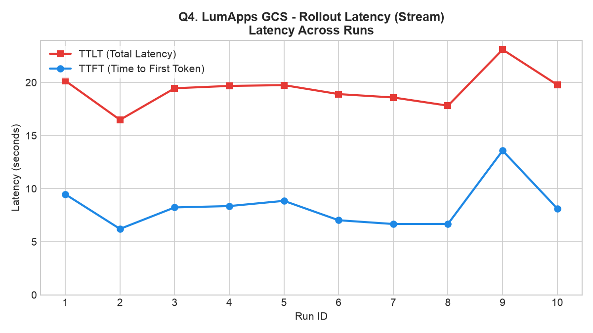

**Latency Bin Distribution**:

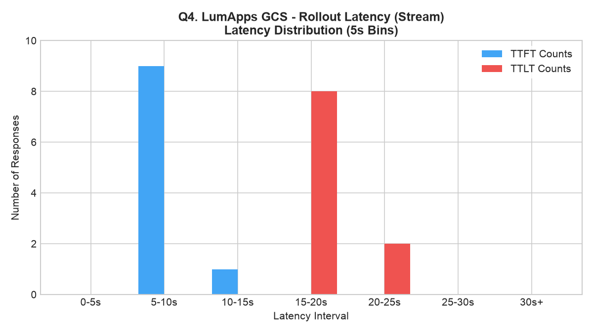

## Scenario: Q4. LumApps GCS - Rollout Latency (UI)
| Run ID | API Used | status_code | TTFT (s) | TTLT (s) | Speed (char/s) | Trace & Screenshot |
| :--- | :--- | :--- | :--- | :--- | :--- | :--- |
| 1 | ui (CDP) | 200 | 21.695 | 22.047 | 352.7 | N/A \| [Screenshot](screenshots/ui_run_1.png) |
| 2 | ui (CDP) | 200 | 19.562 | 20.136 | 369.8 | N/A \| [Screenshot](screenshots/ui_run_2.png) |
| 3 | ui (CDP) | 200 | 20.949 | 21.367 | 499.9 | N/A \| [Screenshot](screenshots/ui_run_3.png) |
| 4 | ui (CDP) | 200 | 26.372 | 27.267 | 214.4 | N/A \| [Screenshot](screenshots/ui_run_4.png) |
| 5 | ui (CDP) | 200 | 25.148 | 26.178 | 327.2 | N/A \| [Screenshot](screenshots/ui_run_5.png) |
| 6 | ui (CDP) | 200 | 18.617 | 19.131 | 183.1 | N/A \| [Screenshot](screenshots/ui_run_6.png) |
| 7 | ui (CDP) | 200 | 17.306 | 19.480 | 45.5 | N/A \| [Screenshot](screenshots/ui_run_7.png) |
| 8 | ui (CDP) | 200 | 20.717 | 24.680 | 67.6 | N/A \| [Screenshot](screenshots/ui_run_8.png) |
| 9 | ui (CDP) | 200 | 20.678 | 26.879 | 45.2 | N/A \| [Screenshot](screenshots/ui_run_9.png) |
| 10 | ui (CDP) | 200 | 23.547 | 23.921 | 480.9 | N/A \| [Screenshot](screenshots/ui_run_10.png) |

**Statistics for Q4. LumApps GCS - Rollout Latency (UI):**
* **Success Rate**: 100.0%
* **TTFT**: Min = 17.306 s, Max = 26.372 s, Avg = 21.459 s, P90 = 26.372 s
* **TTLT**: Min = 19.131 s, Max = 27.267 s, Avg = 23.108 s, P90 = 27.267 s
* **Speed**: Min = 45.155 char/s, Max = 499.880 char/s, Avg = 258.618 char/s, P90 = 499.880 char/s

### 📈 Latency Visualizations

**Latency Across Runs (TTFT vs TTLT)**:

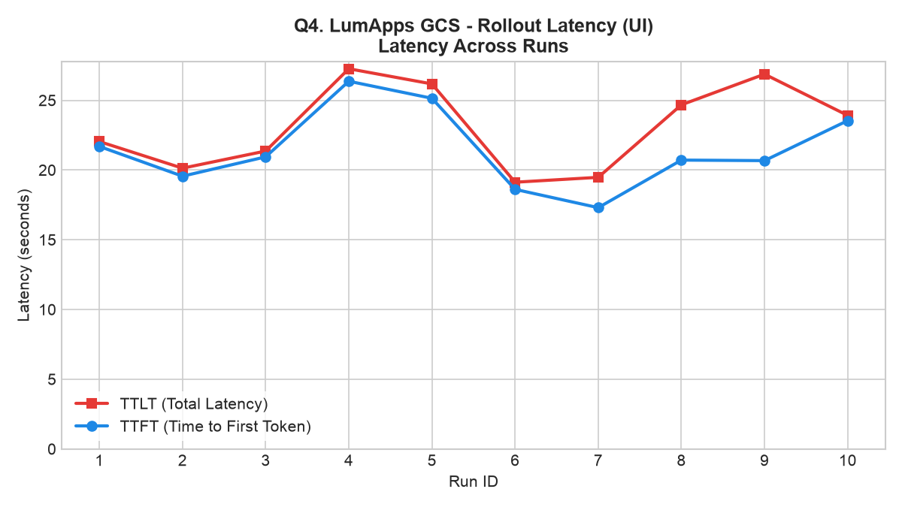

**Latency Bin Distribution**:

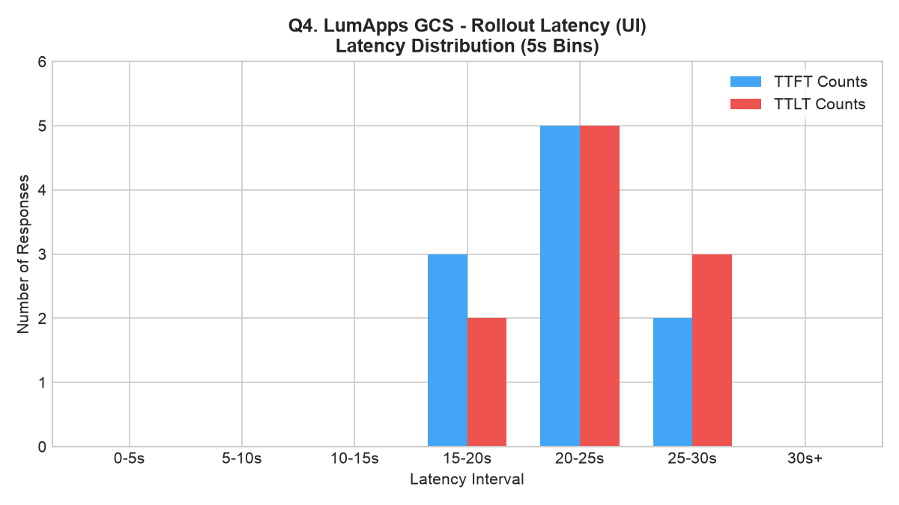

## Scenario: Q5. Confluence + Jira - VPN Issues (Stream)
| Run ID | API Used | status_code | TTFT (s) | TTLT (s) | Speed (char/s) | Trace & Screenshot |
| :--- | :--- | :--- | :--- | :--- | :--- | :--- |
| 1 | streamAssist | 200 | 7.041 | 27.944 | 68.9 | [Trace Link](https://console.cloud.google.com/traces/list?project=genai-alpha-422116&tid=866bfaf48e44419c99df02bf1640ecea) |
| 2 | streamAssist | 200 | 8.629 | 27.371 | 66.0 | [Trace Link](https://console.cloud.google.com/traces/list?project=genai-alpha-422116&tid=c01da69e1a214e42844ccfdaf9acb6d5) |
| 3 | streamAssist | 200 | 8.808 | 32.549 | 52.5 | [Trace Link](https://console.cloud.google.com/traces/list?project=genai-alpha-422116&tid=ee1fd8f479fc465fb61bff5177fd0256) |
| 4 | streamAssist | 200 | 9.089 | 34.404 | 37.7 | [Trace Link](https://console.cloud.google.com/traces/list?project=genai-alpha-422116&tid=254c4a9a6e994a42b4082f07c526ea5d) |
| 5 | streamAssist | 200 | 5.661 | 21.019 | 58.9 | [Trace Link](https://console.cloud.google.com/traces/list?project=genai-alpha-422116&tid=fab1ed3eef4046d181f93f0249c6ee59) |
| 6 | streamAssist | 200 | 7.341 | 31.000 | 41.9 | [Trace Link](https://console.cloud.google.com/traces/list?project=genai-alpha-422116&tid=4777c89c38d14e13a11c2d54479dc72d) |
| 7 | streamAssist | 200 | 7.773 | 27.140 | 40.2 | [Trace Link](https://console.cloud.google.com/traces/list?project=genai-alpha-422116&tid=411fa2a6911d4599aaad2898c6af5cf6) |
| 8 | streamAssist | 200 | 6.962 | 28.116 | 57.9 | [Trace Link](https://console.cloud.google.com/traces/list?project=genai-alpha-422116&tid=e8e72783ae4e4d2db4549038473d9388) |
| 9 | streamAssist | 200 | 6.351 | 25.607 | 49.2 | [Trace Link](https://console.cloud.google.com/traces/list?project=genai-alpha-422116&tid=91232cea97764b90a7282f14e41f0d01) |
| 10 | streamAssist | 200 | 10.882 | 33.158 | 59.7 | [Trace Link](https://console.cloud.google.com/traces/list?project=genai-alpha-422116&tid=d03cc5f05c354aba91dfdf3b6ebf7150) |

**Statistics for Q5. Confluence + Jira - VPN Issues (Stream):**
* **Success Rate**: 100.0%
* **TTFT**: Min = 5.661 s, Max = 10.882 s, Avg = 7.854 s, P90 = 10.882 s
* **TTLT**: Min = 21.019 s, Max = 34.404 s, Avg = 28.831 s, P90 = 34.404 s
* **Speed**: Min = 37.725 char/s, Max = 68.891 char/s, Avg = 53.281 char/s, P90 = 68.891 char/s

### 📈 Latency Visualizations

**Latency Across Runs (TTFT vs TTLT)**:

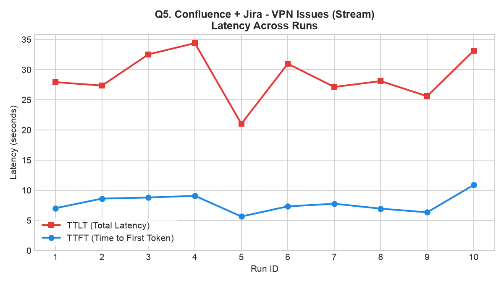

**Latency Bin Distribution**:

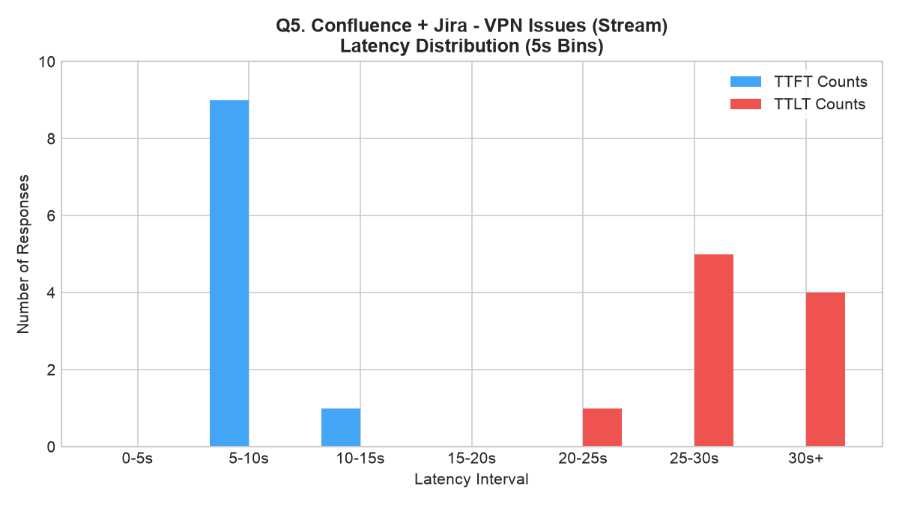

## Scenario: Q5. Confluence + Jira - VPN Issues (UI)
| Run ID | API Used | status_code | TTFT (s) | TTLT (s) | Speed (char/s) | Trace & Screenshot |
| :--- | :--- | :--- | :--- | :--- | :--- | :--- |
| 1 | ui (CDP) | 200 | 26.718 | 28.674 | 453.0 | N/A \| [Screenshot](screenshots/ui_run_1.png) |
| 2 | ui (CDP) | 200 | 23.222 | 26.567 | 298.1 | N/A \| [Screenshot](screenshots/ui_run_2.png) |
| 3 | ui (CDP) | 200 | 32.146 | 34.630 | 299.9 | N/A \| [Screenshot](screenshots/ui_run_3.png) |
| 4 | ui (CDP) | 200 | 42.026 | 43.673 | 691.1 | N/A \| [Screenshot](screenshots/ui_run_4.png) |
| 5 | ui (CDP) | 200 | 25.523 | 27.377 | 511.3 | N/A \| [Screenshot](screenshots/ui_run_5.png) |
| 6 | ui (CDP) | 200 | 22.575 | 24.889 | 283.0 | N/A \| [Screenshot](screenshots/ui_run_6.png) |
| 7 | ui (CDP) | 200 | 17.304 | 18.229 | 179.4 | N/A \| [Screenshot](screenshots/ui_run_7.png) |
| 8 | ui (CDP) | 200 | 33.258 | 34.995 | 404.0 | N/A \| [Screenshot](screenshots/ui_run_8.png) |
| 9 | ui (CDP) | 200 | 26.255 | 27.524 | 534.2 | N/A \| [Screenshot](screenshots/ui_run_9.png) |
| 10 | ui (CDP) | 200 | 32.964 | 34.668 | 428.5 | N/A \| [Screenshot](screenshots/ui_run_10.png) |

**Statistics for Q5. Confluence + Jira - VPN Issues (UI):**
* **Success Rate**: 100.0%
* **TTFT**: Min = 17.304 s, Max = 42.026 s, Avg = 28.199 s, P90 = 42.026 s
* **TTLT**: Min = 18.229 s, Max = 43.673 s, Avg = 30.123 s, P90 = 43.673 s
* **Speed**: Min = 179.421 char/s, Max = 691.079 char/s, Avg = 408.251 char/s, P90 = 691.079 char/s

### 📈 Latency Visualizations

**Latency Across Runs (TTFT vs TTLT)**:

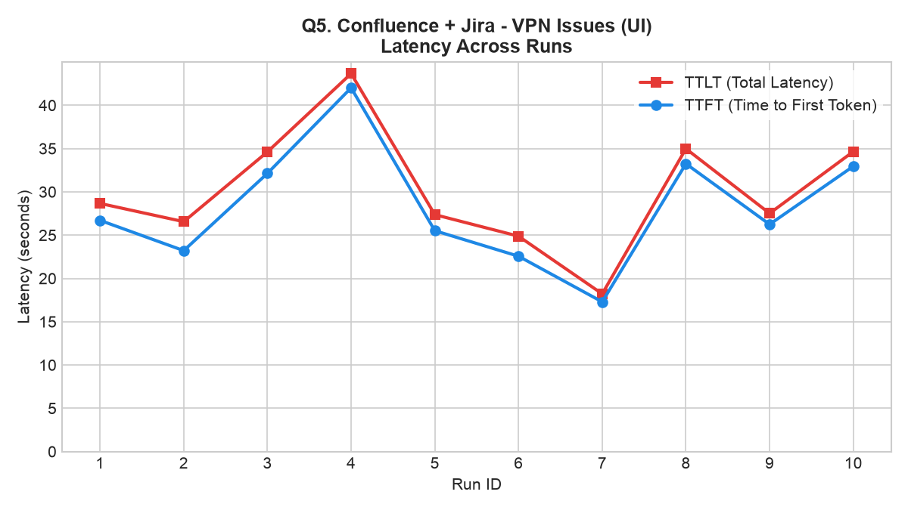

**Latency Bin Distribution**:

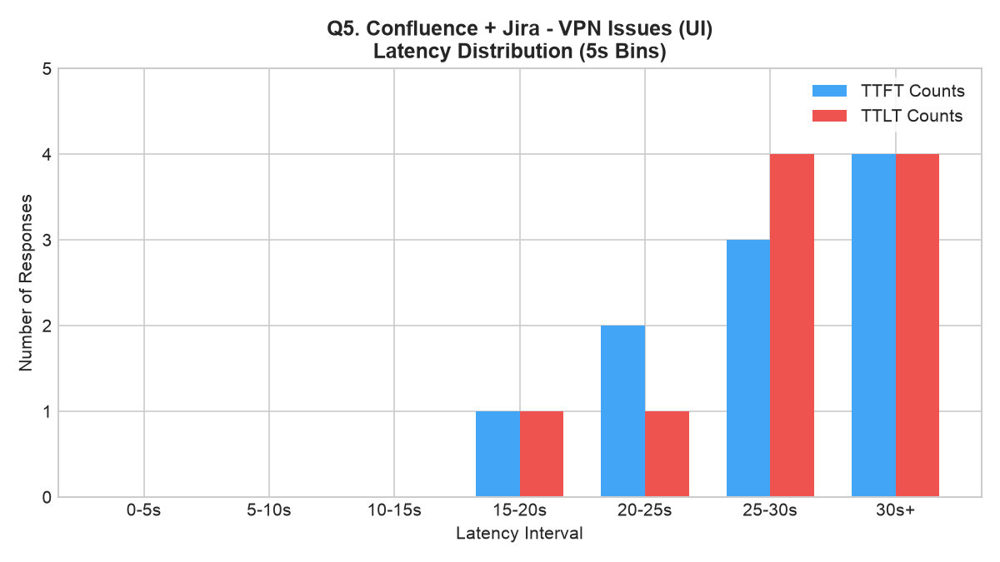

## Scenario: Q6. GDrive + Confluence - Laptop Upgrade Cycle (Stream)
| Run ID | API Used | status_code | TTFT (s) | TTLT (s) | Speed (char/s) | Trace & Screenshot |
| :--- | :--- | :--- | :--- | :--- | :--- | :--- |
| 1 | streamAssist | 200 | 14.291 | 35.807 | 28.1 | [Trace Link](https://console.cloud.google.com/traces/list?project=genai-alpha-422116&tid=e126bb2584e6436fa1a404bbb6206238) |
| 2 | streamAssist | 200 | 8.901 | 27.106 | 35.0 | [Trace Link](https://console.cloud.google.com/traces/list?project=genai-alpha-422116&tid=b648900315644aa292443cfcd7f4c4d1) |
| 3 | streamAssist | 200 | 7.013 | 31.368 | 42.0 | [Trace Link](https://console.cloud.google.com/traces/list?project=genai-alpha-422116&tid=d084a9e7cfe243fdb6ec9c14d65f8fdb) |
| 4 | streamAssist | 200 | 7.747 | 27.026 | 37.6 | [Trace Link](https://console.cloud.google.com/traces/list?project=genai-alpha-422116&tid=33d07ff62f2d4d64a285926cf32c7838) |
| 5 | streamAssist | 200 | 8.279 | 60.360 | 27.6 | [Trace Link](https://console.cloud.google.com/traces/list?project=genai-alpha-422116&tid=c85e08dd43e94e84917bdc83fd3fab5a) |
| 6 | streamAssist | 200 | 7.650 | 43.099 | 15.0 | [Trace Link](https://console.cloud.google.com/traces/list?project=genai-alpha-422116&tid=0b1ef64df34349a3a416ed84dc2c73ea) |
| 7 | streamAssist | 200 | 6.214 | 31.961 | 27.6 | [Trace Link](https://console.cloud.google.com/traces/list?project=genai-alpha-422116&tid=47ed0b08bff04d79ad5be00f3afb931f) |
| 8 | streamAssist | 200 | 8.352 | 29.231 | 49.4 | [Trace Link](https://console.cloud.google.com/traces/list?project=genai-alpha-422116&tid=d906ec9c09674f04861b7bf7549640c8) |
| 9 | streamAssist | 200 | 7.572 | 33.738 | 32.2 | [Trace Link](https://console.cloud.google.com/traces/list?project=genai-alpha-422116&tid=3cdf59916d7142939d72fca91470d024) |
| 10 | streamAssist | 200 | 6.824 | 38.037 | 30.1 | [Trace Link](https://console.cloud.google.com/traces/list?project=genai-alpha-422116&tid=5dc7b26075914bfbb75ad22616503457) |

**Statistics for Q6. GDrive + Confluence - Laptop Upgrade Cycle (Stream):**
* **Success Rate**: 100.0%
* **TTFT**: Min = 6.214 s, Max = 14.291 s, Avg = 8.284 s, P90 = 14.291 s
* **TTLT**: Min = 27.026 s, Max = 60.360 s, Avg = 35.773 s, P90 = 60.360 s
* **Speed**: Min = 15.008 char/s, Max = 49.381 char/s, Avg = 32.447 char/s, P90 = 49.381 char/s

### 📈 Latency Visualizations

**Latency Across Runs (TTFT vs TTLT)**:

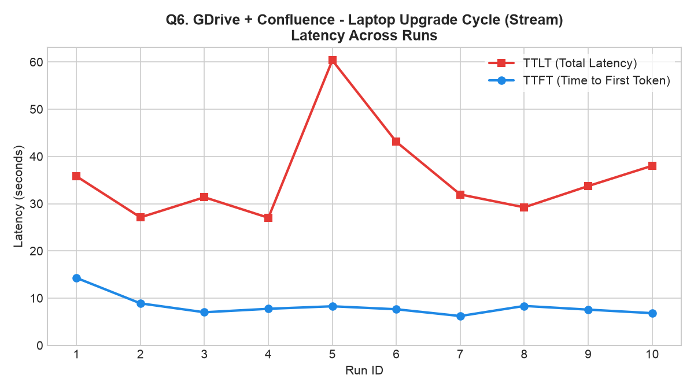

**Latency Bin Distribution**:

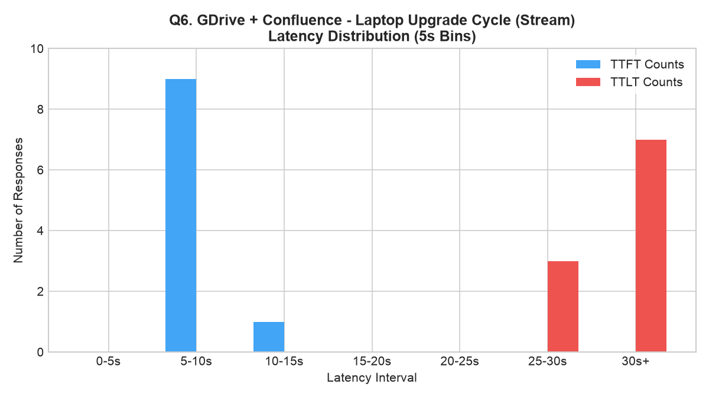

## Scenario: Q6. GDrive + Confluence - Laptop Upgrade Cycle (UI)
| Run ID | API Used | status_code | TTFT (s) | TTLT (s) | Speed (char/s) | Trace & Screenshot |
| :--- | :--- | :--- | :--- | :--- | :--- | :--- |
| 1 | ui (CDP) | 200 | 26.115 | 27.424 | 465.9 | N/A \| [Screenshot](screenshots/ui_run_1.png) |
| 2 | ui (CDP) | 200 | 27.921 | 28.897 | 459.7 | N/A \| [Screenshot](screenshots/ui_run_2.png) |
| 3 | ui (CDP) | 200 | 26.983 | 27.630 | 504.1 | N/A \| [Screenshot](screenshots/ui_run_3.png) |
| 4 | ui (CDP) | 200 | 27.888 | 28.669 | 280.4 | N/A \| [Screenshot](screenshots/ui_run_4.png) |
| 5 | ui (CDP) | 200 | 23.123 | 23.807 | 418.2 | N/A \| [Screenshot](screenshots/ui_run_5.png) |
| 6 | ui (CDP) | 200 | 30.217 | 32.059 | 359.0 | N/A \| [Screenshot](screenshots/ui_run_6.png) |
| 7 | ui (CDP) | 200 | 27.403 | 28.046 | 611.9 | N/A \| [Screenshot](screenshots/ui_run_7.png) |
| 8 | ui (CDP) | 200 | 33.068 | 35.765 | 206.8 | N/A \| [Screenshot](screenshots/ui_run_8.png) |
| 9 | ui (CDP) | 200 | 21.837 | 23.379 | 361.1 | N/A \| [Screenshot](screenshots/ui_run_9.png) |
| 10 | ui (CDP) | 200 | 41.379 | 42.553 | 465.4 | N/A \| [Screenshot](screenshots/ui_run_10.png) |

**Statistics for Q6. GDrive + Confluence - Laptop Upgrade Cycle (UI):**
* **Success Rate**: 100.0%
* **TTFT**: Min = 21.837 s, Max = 41.379 s, Avg = 28.593 s, P90 = 41.379 s
* **TTLT**: Min = 23.379 s, Max = 42.553 s, Avg = 29.823 s, P90 = 42.553 s
* **Speed**: Min = 206.835 char/s, Max = 611.864 char/s, Avg = 413.251 char/s, P90 = 611.864 char/s

### 📈 Latency Visualizations

**Latency Across Runs (TTFT vs TTLT)**:

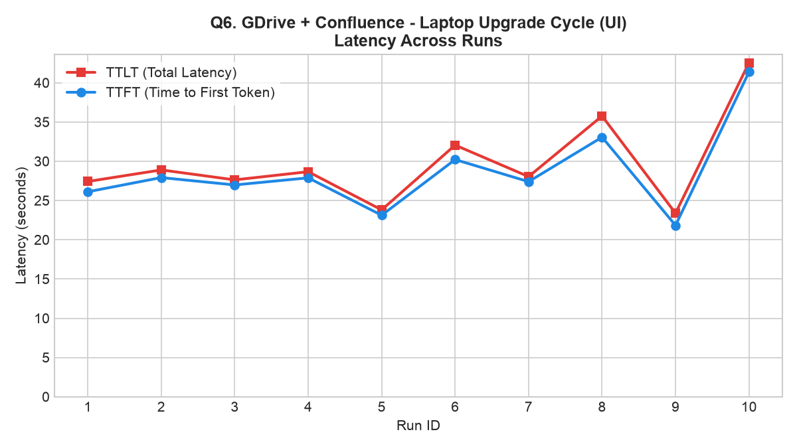

**Latency Bin Distribution**:

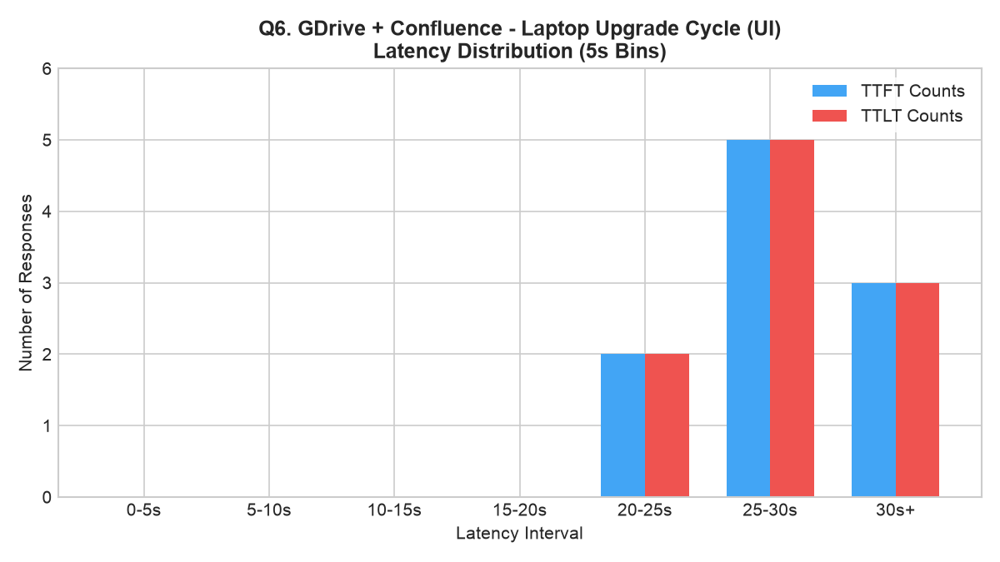

## Scenario: Q7. LumApps + Jira - Dev Workspace Tools (Stream)
| Run ID | API Used | status_code | TTFT (s) | TTLT (s) | Speed (char/s) | Trace & Screenshot |
| :--- | :--- | :--- | :--- | :--- | :--- | :--- |
| 1 | streamAssist | 200 | 7.695 | 27.242 | 34.9 | [Trace Link](https://console.cloud.google.com/traces/list?project=genai-alpha-422116&tid=3cb0442d6e4d474f9b9f5a37c7bf8695) |
| 2 | streamAssist | 200 | 7.760 | 32.364 | 32.7 | [Trace Link](https://console.cloud.google.com/traces/list?project=genai-alpha-422116&tid=be491433826f44c1877e4fa6cddc03a5) |
| 3 | streamAssist | 200 | 7.439 | 23.452 | 43.2 | [Trace Link](https://console.cloud.google.com/traces/list?project=genai-alpha-422116&tid=6dfa366123134e46a86c443d9a240eb2) |
| 4 | streamAssist | 200 | 7.130 | 46.074 | 18.3 | [Trace Link](https://console.cloud.google.com/traces/list?project=genai-alpha-422116&tid=d9e0ca02c2cc4f37a4b735821417c913) |
| 5 | streamAssist | 200 | 7.664 | 20.718 | 47.4 | [Trace Link](https://console.cloud.google.com/traces/list?project=genai-alpha-422116&tid=b63c8c61514b41acb2789c1892d505ad) |
| 6 | streamAssist | 200 | 7.545 | 25.047 | 36.9 | [Trace Link](https://console.cloud.google.com/traces/list?project=genai-alpha-422116&tid=2fc6c883b8ad45f3b10a554fc94506bb) |
| 7 | streamAssist | 200 | 8.571 | 23.901 | 52.4 | [Trace Link](https://console.cloud.google.com/traces/list?project=genai-alpha-422116&tid=9e7febe7f4a645b990ecf3cfee2647c6) |
| 8 | streamAssist | 200 | 8.329 | 22.447 | 47.2 | [Trace Link](https://console.cloud.google.com/traces/list?project=genai-alpha-422116&tid=82fa031973344e1eaba27f6cfd2ef041) |
| 9 | streamAssist | 200 | 7.966 | 27.834 | 37.3 | [Trace Link](https://console.cloud.google.com/traces/list?project=genai-alpha-422116&tid=011070c1aa654f3c9d2a88a6f8a5bc8f) |
| 10 | streamAssist | 200 | 8.324 | 23.494 | 51.3 | [Trace Link](https://console.cloud.google.com/traces/list?project=genai-alpha-422116&tid=d1b63b19ba4f40e2b9a33123814587c8) |

**Statistics for Q7. LumApps + Jira - Dev Workspace Tools (Stream):**
* **Success Rate**: 100.0%
* **TTFT**: Min = 7.130 s, Max = 8.571 s, Avg = 7.842 s, P90 = 8.571 s
* **TTLT**: Min = 20.718 s, Max = 46.074 s, Avg = 27.257 s, P90 = 46.074 s
* **Speed**: Min = 18.308 char/s, Max = 52.447 char/s, Avg = 40.178 char/s, P90 = 52.447 char/s

### 📈 Latency Visualizations

**Latency Across Runs (TTFT vs TTLT)**:

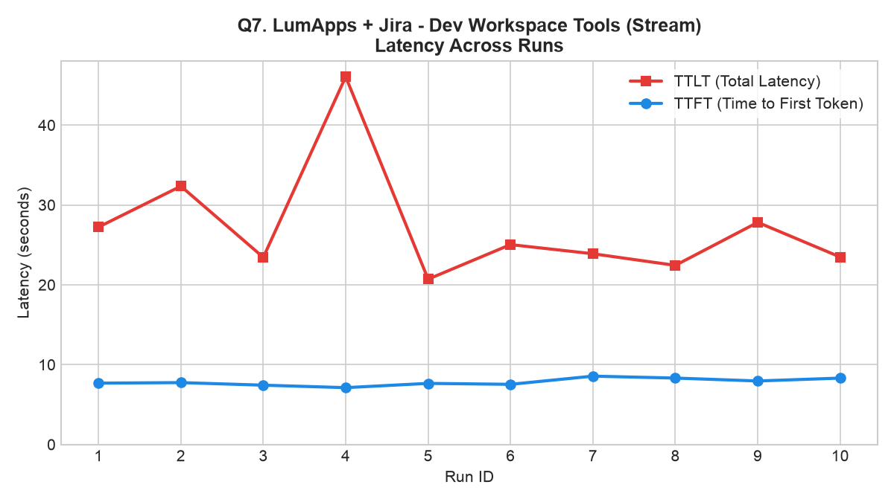

**Latency Bin Distribution**:

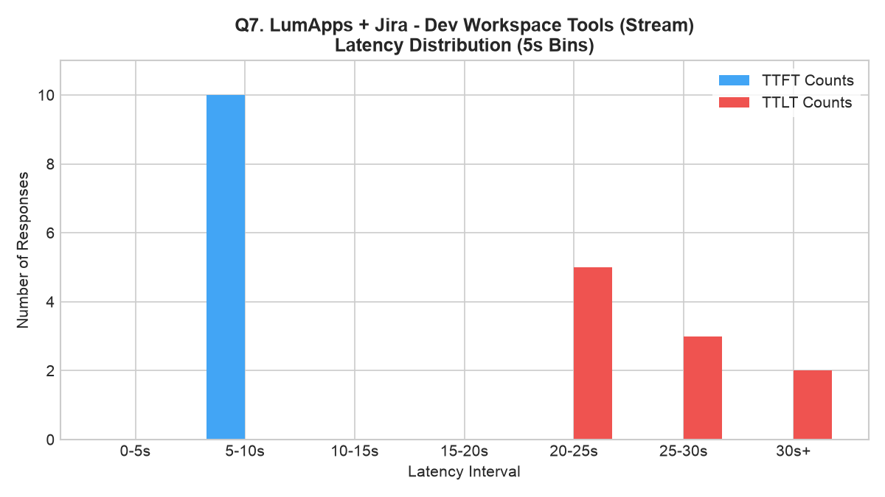

## Scenario: Q7. LumApps + Jira - Dev Workspace Tools (UI)
| Run ID | API Used | status_code | TTFT (s) | TTLT (s) | Speed (char/s) | Trace & Screenshot |
| :--- | :--- | :--- | :--- | :--- | :--- | :--- |
| 1 | ui (CDP) | 200 | 23.621 | 24.590 | 403.3 | N/A \| [Screenshot](screenshots/ui_run_1.png) |
| 2 | ui (CDP) | 200 | 22.662 | 25.040 | 195.9 | N/A \| [Screenshot](screenshots/ui_run_2.png) |
| 3 | ui (CDP) | 200 | 20.362 | 22.313 | 232.7 | N/A \| [Screenshot](screenshots/ui_run_3.png) |
| 4 | ui (CDP) | 200 | 23.924 | 25.107 | 381.3 | N/A \| [Screenshot](screenshots/ui_run_4.png) |
| 5 | ui (CDP) | 200 | 22.695 | 24.096 | 324.1 | N/A \| [Screenshot](screenshots/ui_run_5.png) |
| 6 | ui (CDP) | 200 | 24.413 | 25.604 | 531.4 | N/A \| [Screenshot](screenshots/ui_run_6.png) |
| 7 | ui (CDP) | 200 | 21.241 | 22.254 | 425.7 | N/A \| [Screenshot](screenshots/ui_run_7.png) |
| 8 | ui (CDP) | 200 | 20.973 | 23.269 | 188.6 | N/A \| [Screenshot](screenshots/ui_run_8.png) |
| 9 | ui (CDP) | 200 | 23.768 | 25.080 | 469.4 | N/A \| [Screenshot](screenshots/ui_run_9.png) |
| 10 | ui (CDP) | 200 | 23.404 | 24.667 | 488.0 | N/A \| [Screenshot](screenshots/ui_run_10.png) |

**Statistics for Q7. LumApps + Jira - Dev Workspace Tools (UI):**
* **Success Rate**: 100.0%
* **TTFT**: Min = 20.362 s, Max = 24.413 s, Avg = 22.706 s, P90 = 24.413 s
* **TTLT**: Min = 22.254 s, Max = 25.604 s, Avg = 24.202 s, P90 = 25.604 s
* **Speed**: Min = 188.589 char/s, Max = 531.442 char/s, Avg = 364.038 char/s, P90 = 531.442 char/s

### 📈 Latency Visualizations

**Latency Across Runs (TTFT vs TTLT)**:

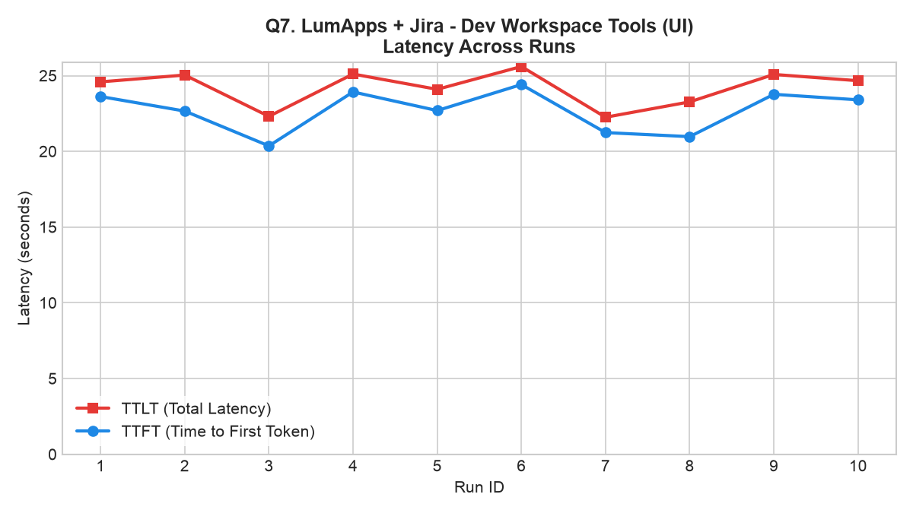

**Latency Bin Distribution**:

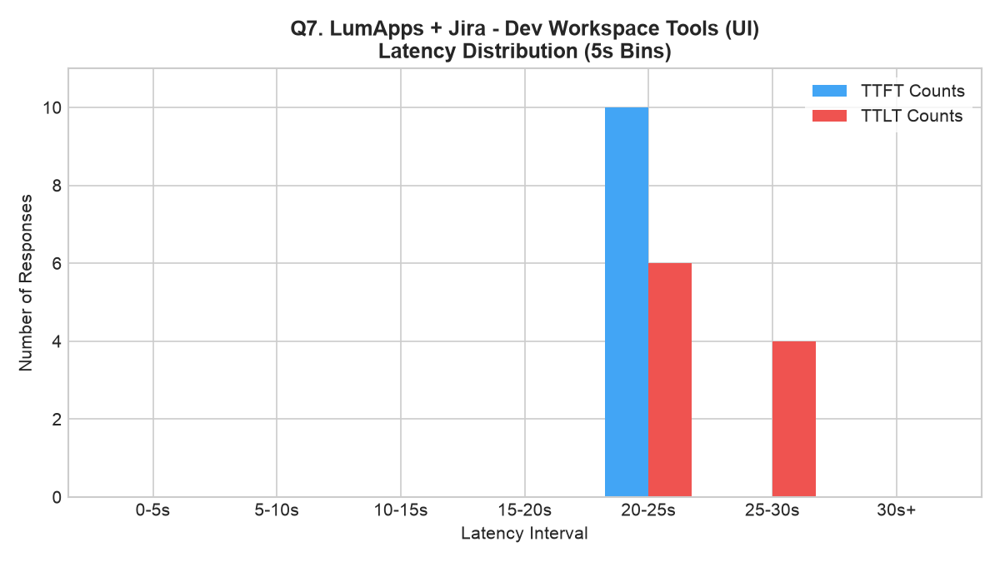

## Scenario: Q8. GDrive + Confluence + Jira - Remote Work (Stream)
| Run ID | API Used | status_code | TTFT (s) | TTLT (s) | Speed (char/s) | Trace & Screenshot |
| :--- | :--- | :--- | :--- | :--- | :--- | :--- |
| 1 | streamAssist | 200 | 11.914 | 53.627 | 34.8 | [Trace Link](https://console.cloud.google.com/traces/list?project=genai-alpha-422116&tid=4ed24879d86c46da97b98fab148dd3de) |
| 2 | streamAssist | 200 | 6.754 | 33.059 | 53.2 | [Trace Link](https://console.cloud.google.com/traces/list?project=genai-alpha-422116&tid=e360476d7032463bad5fc98c1fac1e92) |
| 3 | streamAssist | 200 | 6.324 | 37.144 | 45.2 | [Trace Link](https://console.cloud.google.com/traces/list?project=genai-alpha-422116&tid=c1baf47514184c0ca21dad8242100c97) |
| 4 | streamAssist | 200 | 8.095 | 36.965 | 55.9 | [Trace Link](https://console.cloud.google.com/traces/list?project=genai-alpha-422116&tid=96caaa15a5864556839b588e6e095b34) |
| 5 | streamAssist | 200 | 6.458 | 31.873 | 62.1 | [Trace Link](https://console.cloud.google.com/traces/list?project=genai-alpha-422116&tid=ef459657f2f24393b6cb3987b17e9ae0) |
| 6 | streamAssist | 200 | 6.791 | 47.766 | 35.4 | [Trace Link](https://console.cloud.google.com/traces/list?project=genai-alpha-422116&tid=bc772ec207784a7ba8c4c001222c3958) |
| 7 | streamAssist | 200 | 7.036 | 30.096 | 74.7 | [Trace Link](https://console.cloud.google.com/traces/list?project=genai-alpha-422116&tid=491ed6ccaf574809b87b2a8ce15e3b94) |
| 8 | streamAssist | 200 | 8.866 | 39.680 | 39.8 | [Trace Link](https://console.cloud.google.com/traces/list?project=genai-alpha-422116&tid=02dc77d2c8e14a4c8ec072efed7fe486) |
| 9 | streamAssist | 200 | 7.906 | 36.668 | 38.5 | [Trace Link](https://console.cloud.google.com/traces/list?project=genai-alpha-422116&tid=f6bd7c532b174625a37d715660536f56) |
| 10 | streamAssist | 200 | 7.812 | 34.391 | 66.0 | [Trace Link](https://console.cloud.google.com/traces/list?project=genai-alpha-422116&tid=6870e7efec734e2990ea5318676c2cfb) |

**Statistics for Q8. GDrive + Confluence + Jira - Remote Work (Stream):**
* **Success Rate**: 100.0%
* **TTFT**: Min = 6.324 s, Max = 11.914 s, Avg = 7.796 s, P90 = 11.914 s
* **TTLT**: Min = 30.096 s, Max = 53.627 s, Avg = 38.127 s, P90 = 53.627 s
* **Speed**: Min = 34.785 char/s, Max = 74.719 char/s, Avg = 50.550 char/s, P90 = 74.719 char/s

### 📈 Latency Visualizations

**Latency Across Runs (TTFT vs TTLT)**:

**Latency Bin Distribution**:

## Scenario: Q8. GDrive + Confluence + Jira - Remote Work (UI)
| Run ID | API Used | status_code | TTFT (s) | TTLT (s) | Speed (char/s) | Trace & Screenshot |
| :--- | :--- | :--- | :--- | :--- | :--- | :--- |
| 1 | ui (CDP) | 200 | 41.362 | 54.451 | 74.1 | N/A \| [Screenshot](screenshots/ui_run_1.png) |
| 2 | ui (CDP) | 200 | 42.225 | 55.530 | 81.4 | N/A \| [Screenshot](screenshots/ui_run_2.png) |
| 3 | ui (CDP) | 500 | ERROR | ERROR | 0.0 | Timeout waiting for response (Console: r |
| 4 | ui (CDP) | 200 | 83.984 | 86.990 | 377.6 | N/A \| [Screenshot](screenshots/ui_run_4.png) |
| 5 | ui (CDP) | 200 | 63.157 | 65.709 | 338.9 | N/A \| [Screenshot](screenshots/ui_run_5.png) |
| 6 | ui (CDP) | 200 | 31.644 | 37.281 | 134.5 | N/A \| [Screenshot](screenshots/ui_run_6.png) |
| 7 | ui (CDP) | 200 | 34.972 | 46.674 | 89.6 | N/A \| [Screenshot](screenshots/ui_run_7.png) |
| 8 | ui (CDP) | 200 | 43.243 | 52.204 | 103.4 | N/A \| [Screenshot](screenshots/ui_run_8.png) |
| 9 | ui (CDP) | 200 | 34.982 | 40.710 | 185.6 | N/A \| [Screenshot](screenshots/ui_run_9.png) |
| 10 | ui (CDP) | 200 | 33.861 | 38.044 | 227.6 | N/A \| [Screenshot](screenshots/ui_run_10.png) |

**Statistics for Q8. GDrive + Confluence + Jira - Remote Work (UI):**
* **Success Rate**: 90.0%
* **TTFT**: Min = 31.644 s, Max = 83.984 s, Avg = 45.492 s, P90 = 83.984 s
* **TTLT**: Min = 37.281 s, Max = 86.990 s, Avg = 53.066 s, P90 = 86.990 s
* **Speed**: Min = 74.105 char/s, Max = 377.553 char/s, Avg = 179.189 char/s, P90 = 377.553 char/s

### 📈 Latency Visualizations

**Latency Across Runs (TTFT vs TTLT)**:

**Latency Bin Distribution**:

## Scenario: Q9. 3-Way IT Checklist (Stream)
| Run ID | API Used | status_code | TTFT (s) | TTLT (s) | Speed (char/s) | Trace & Screenshot |
| :--- | :--- | :--- | :--- | :--- | :--- | :--- |
| 1 | streamAssist | 200 | 7.705 | 28.729 | 73.7 | [Trace Link](https://console.cloud.google.com/traces/list?project=genai-alpha-422116&tid=0cc8071a2a3f4008825cd09c48b1d7ad) |
| 2 | streamAssist | 200 | 7.688 | 30.684 | 66.8 | [Trace Link](https://console.cloud.google.com/traces/list?project=genai-alpha-422116&tid=a56f2bd51f704fa2ae3e34e38a507465) |
| 3 | streamAssist | 200 | 6.920 | 31.735 | 56.9 | [Trace Link](https://console.cloud.google.com/traces/list?project=genai-alpha-422116&tid=f60e4e4ff8c345f699ac94cdaf6bfc20) |
| 4 | streamAssist | 200 | 6.746 | 27.760 | 60.3 | [Trace Link](https://console.cloud.google.com/traces/list?project=genai-alpha-422116&tid=be2d07124c994bcf81c6ebd0e9131bbd) |
| 5 | streamAssist | 200 | 10.958 | 34.240 | 53.5 | [Trace Link](https://console.cloud.google.com/traces/list?project=genai-alpha-422116&tid=608f0cced6404edd89c1c81490fc4a2d) |
| 6 | streamAssist | 200 | 9.077 | 31.475 | 65.7 | [Trace Link](https://console.cloud.google.com/traces/list?project=genai-alpha-422116&tid=e5fc9a2988e0406a9a5c67a73579e935) |
| 7 | streamAssist | 200 | 8.163 | 27.405 | 67.5 | [Trace Link](https://console.cloud.google.com/traces/list?project=genai-alpha-422116&tid=802e6010e0424717aa70547902c71c0e) |
| 8 | streamAssist | 200 | 8.304 | 25.138 | 84.5 | [Trace Link](https://console.cloud.google.com/traces/list?project=genai-alpha-422116&tid=bd2ddcbc98074c6b8def44f8366e71fd) |
| 9 | streamAssist | 200 | 7.263 | 25.525 | 61.7 | [Trace Link](https://console.cloud.google.com/traces/list?project=genai-alpha-422116&tid=0d9b542dfa954017a443fc37e82adafa) |
| 10 | streamAssist | 200 | N/A | 159.801 | 0.0 | [Trace Link](https://console.cloud.google.com/traces/list?project=genai-alpha-422116&tid=26339f20bc7747508324166106933775) |

**Statistics for Q9. 3-Way IT Checklist (Stream):**
* **Success Rate**: 100.0%
* **TTFT**: Min = 6.746 s, Max = 10.958 s, Avg = 8.092 s, P90 = 10.958 s
* **TTLT**: Min = 25.138 s, Max = 159.801 s, Avg = 42.249 s, P90 = 159.801 s
* **Speed**: Min = 53.476 char/s, Max = 84.472 char/s, Avg = 65.617 char/s, P90 = 84.472 char/s

### 📈 Latency Visualizations

**Latency Across Runs (TTFT vs TTLT)**:

**Latency Bin Distribution**:

## Scenario: Q9. 3-Way IT Checklist (UI)
| Run ID | API Used | status_code | TTFT (s) | TTLT (s) | Speed (char/s) | Trace & Screenshot |
| :--- | :--- | :--- | :--- | :--- | :--- | :--- |
| 1 | ui (CDP) | 200 | 23.189 | 26.768 | 317.9 | N/A \| [Screenshot](screenshots/ui_run_1.png) |
| 2 | ui (CDP) | 200 | 35.281 | 37.655 | 516.4 | N/A \| [Screenshot](screenshots/ui_run_2.png) |
| 3 | ui (CDP) | 200 | 26.046 | 28.192 | 477.7 | N/A \| [Screenshot](screenshots/ui_run_3.png) |
| 4 | ui (CDP) | 200 | 28.850 | 33.123 | 193.1 | N/A \| [Screenshot](screenshots/ui_run_4.png) |
| 5 | ui (CDP) | 200 | 26.562 | 31.279 | 196.9 | N/A \| [Screenshot](screenshots/ui_run_5.png) |
| 6 | ui (CDP) | 200 | 34.151 | 37.733 | 322.1 | N/A \| [Screenshot](screenshots/ui_run_6.png) |
| 7 | ui (CDP) | 200 | 47.632 | 48.902 | 591.7 | N/A \| [Screenshot](screenshots/ui_run_7.png) |
| 8 | ui (CDP) | 200 | 30.275 | 43.125 | 108.5 | N/A \| [Screenshot](screenshots/ui_run_8.png) |
| 9 | ui (CDP) | 200 | 30.533 | 37.049 | 145.3 | N/A \| [Screenshot](screenshots/ui_run_9.png) |
| 10 | ui (CDP) | 200 | 32.913 | 35.550 | 466.0 | N/A \| [Screenshot](screenshots/ui_run_10.png) |

**Statistics for Q9. 3-Way IT Checklist (UI):**
* **Success Rate**: 100.0%
* **TTFT**: Min = 23.189 s, Max = 47.632 s, Avg = 31.543 s, P90 = 47.632 s
* **TTLT**: Min = 26.768 s, Max = 48.902 s, Avg = 35.938 s, P90 = 48.902 s
* **Speed**: Min = 108.487 char/s, Max = 591.711 char/s, Avg = 333.574 char/s, P90 = 591.711 char/s

### 📈 Latency Visualizations

**Latency Across Runs (TTFT vs TTLT)**:

**Latency Bin Distribution**:

## 🖼️ Web App UI Run Screenshots

### UI Run 1
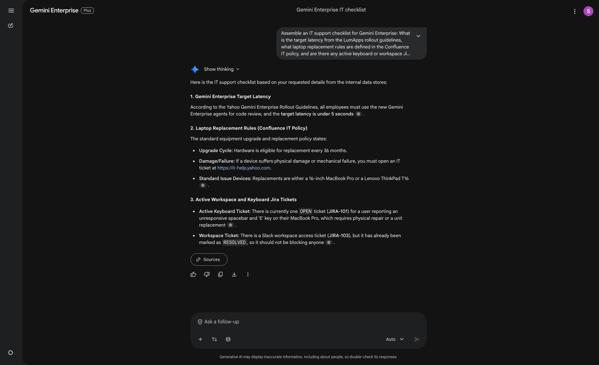

### UI Run 2
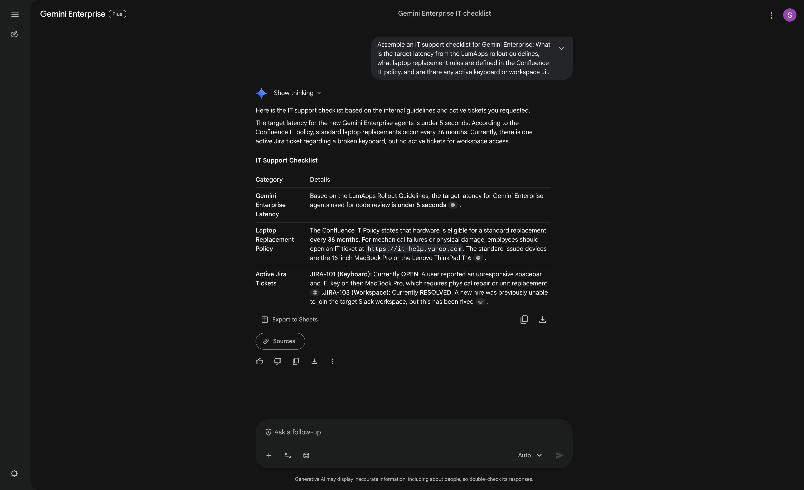

### UI Run 3
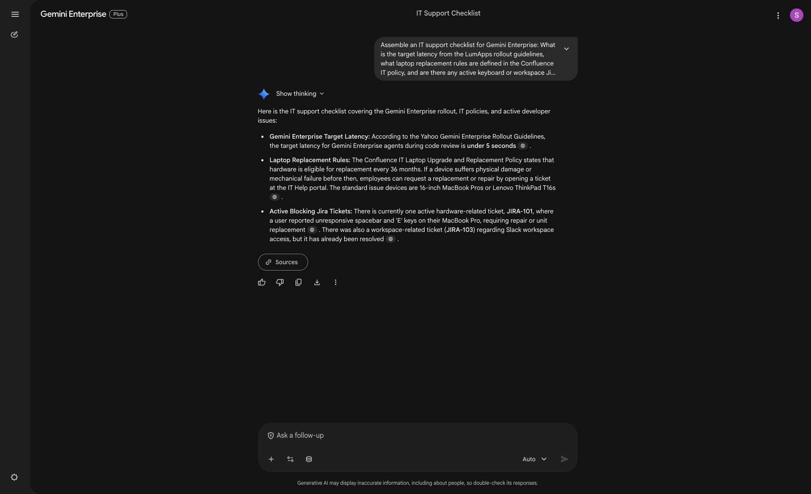

### UI Run 4
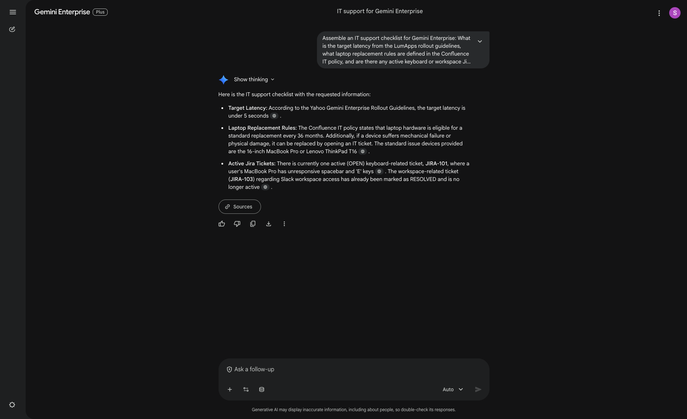

### UI Run 5
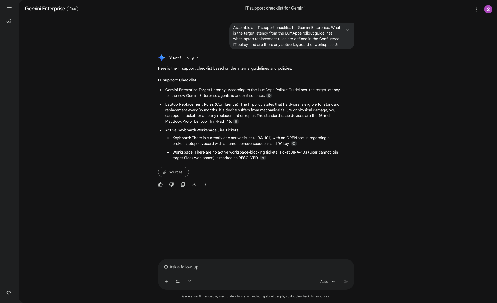

### UI Run 6
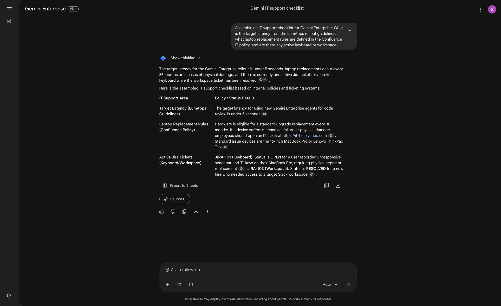

### UI Run 7
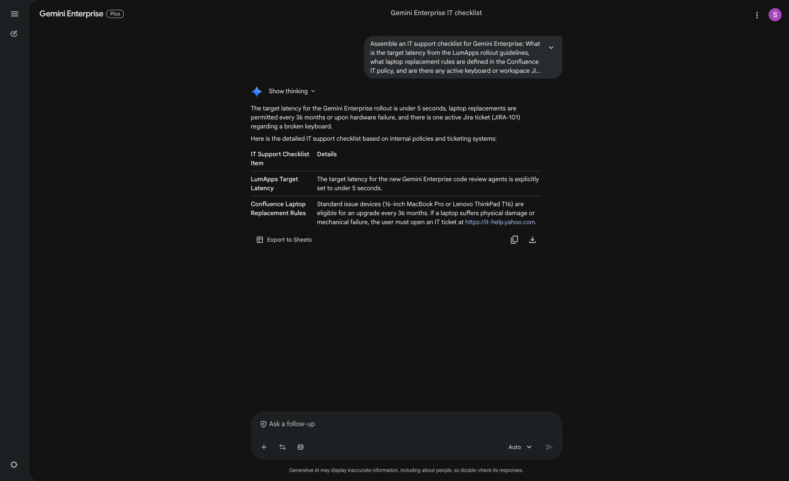

### UI Run 8
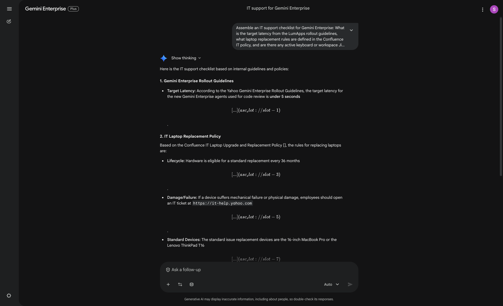

### UI Run 9
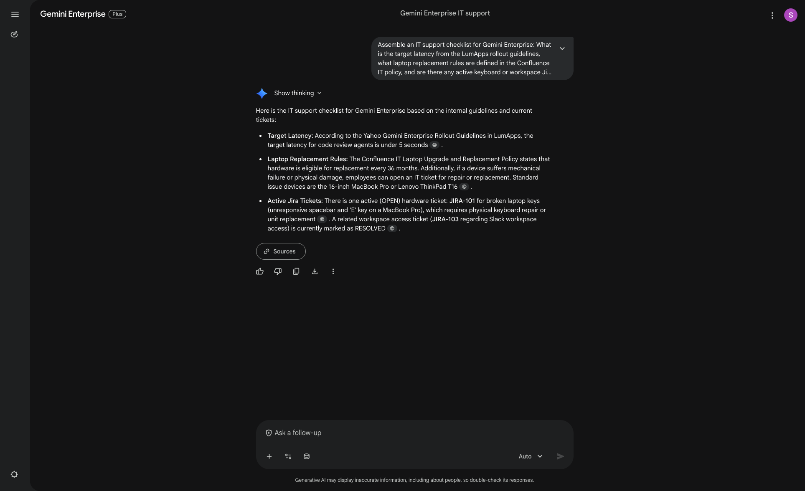

### UI Run 10
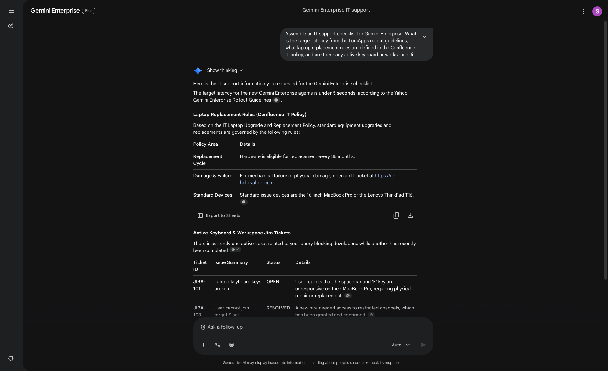

