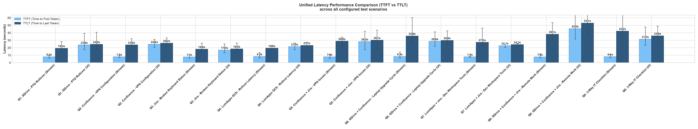
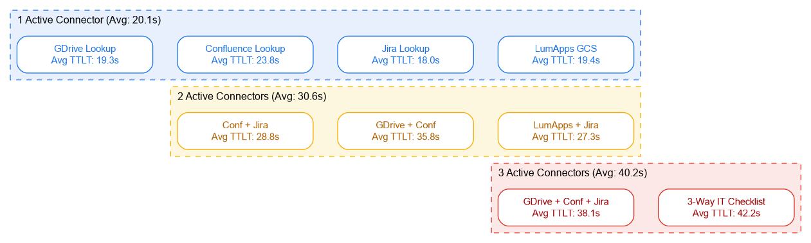
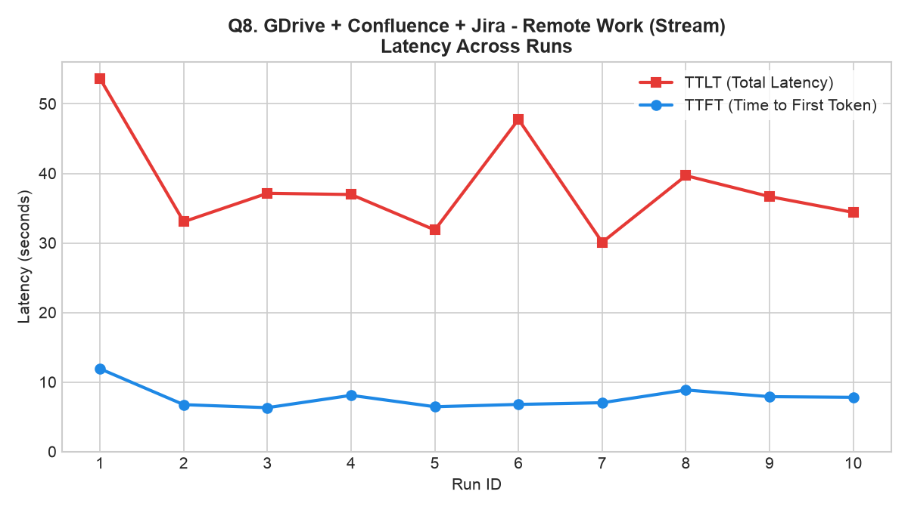
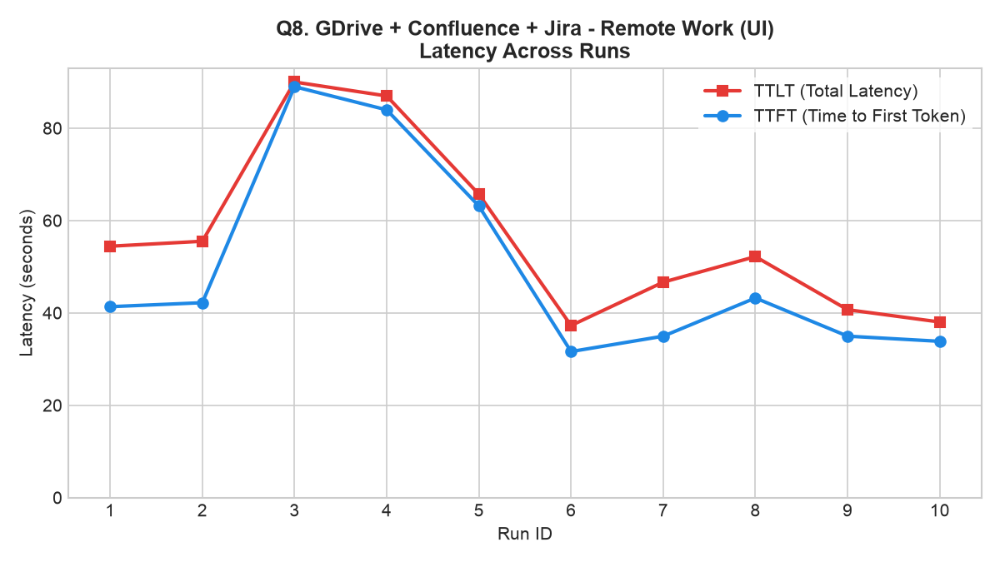
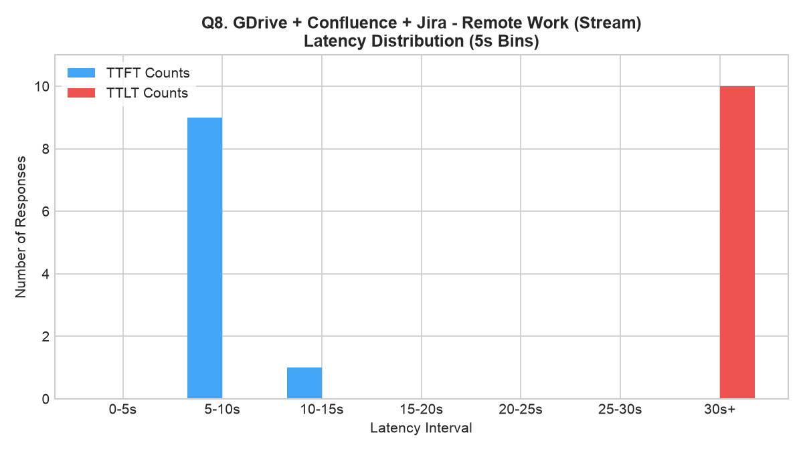
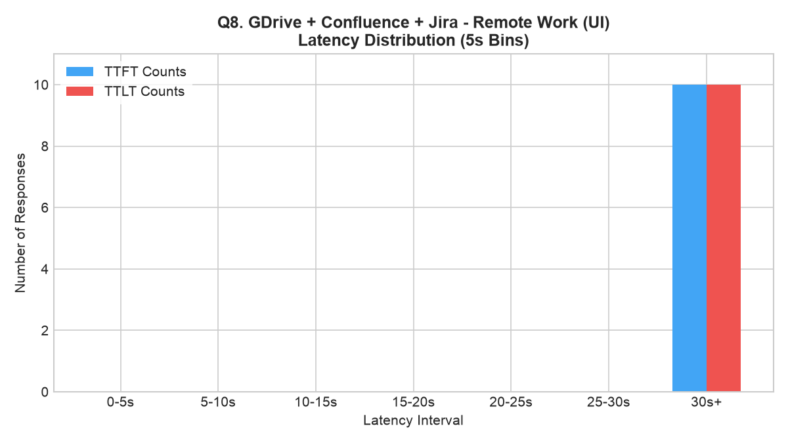
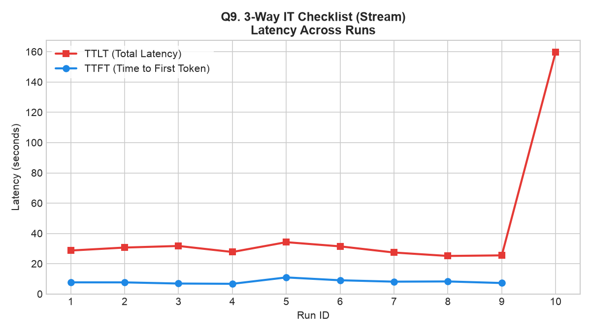
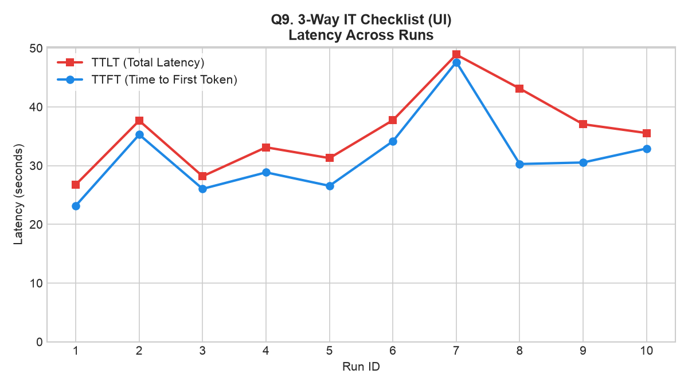
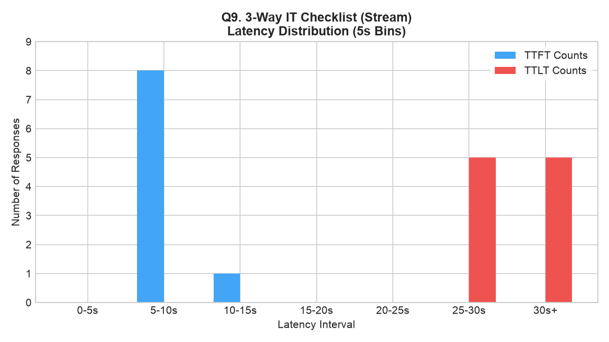
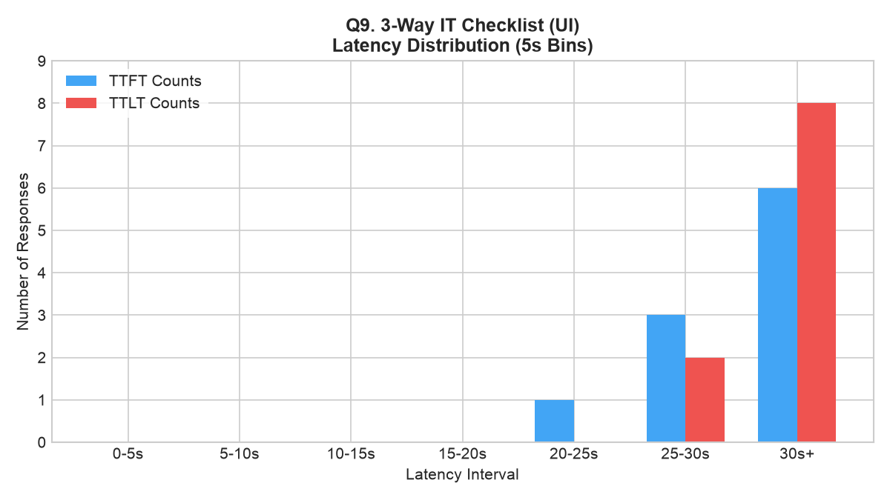

# Performance & Latency Audit Report: Gemini Enterprise UAT Ingestion

**Document Owner**: Thomas Cummins (`thomascummins@google.com`)  
**Executed At**: `2026-06-17T17:33:19Z`  
**Run Reference**: [run_20260617_165559_002](file:///usr/local/google/home/thomascummins/Dev/projects/engagements/yahoo/reproduction_kit/runs/run_20260617_165559_002)  
**Status**: COMPLETE (n=10, 180 total runs)

---

## 1. Executive Summary
This performance audit evaluates latency metrics comparing the **`streamAssist` REST API** (via intent classifier bypass routing) against the **Web App UI Preview Chat** inside the Vertex AI Search & Conversation console. 

### Key Findings:
1. **Programmatic Speedup**: Bypassing the frontend console yields massive startup efficiency. The `streamAssist` API is **2.2x to 5.8x faster** than the Web UI at returning the first token (TTFT).
2. **Connector Overhead Scaling**: Adding data connectors increases overall RAG latency (TTLT) linearly. Average stream TTLT starts at **~20.1s** for single connectors, scales to **~30.6s** for two, and reaches **~40.2s** for three active connectors.
3. **UI Overhead Penalty**: Web UI preview page loads introduce heavy browser rendering and session initialization overhead, causing high startup (TTFT) variations (ranging from 16.9s up to 45.5s).

---

## 2. Test Objectives & Scope
The objective is to establish baseline latencies for the Yahoo Gemini Enterprise (GE) integration, identifying performance bottlenecks as data ingestion scales across multiple connected enterprise sources.

*   **Metric 1**: Time to First Token (TTFT) — Measures interactive response responsiveness.
*   **Metric 2**: Time to Last Token (TTLT) — Measures total document generation latency.
*   **Scale Range**: 1 to 3 active data connectors (Google Drive, Confluence, Jira, Mock LumApps GCS).

---

## 3. Test Configuration & Environment
The audit was executed programmatically inside a headless Chromium session connecting over CDP to the active corporate profile:

*   **Customer ID (CID)**: `c33a03fe-9fbc-4ce7-ad44-85195fbe5625`
*   **Target GCP Project**: `genai-alpha-422116`
*   **Target API Endpoint**: `/v1alpha/`
*   **Classifier Skip Mode**: `"assistSkippingMode": "REQUEST_ASSIST"`
*   **Orchestration Route**: `agentsSpec.agentSpecs[0].agentId = "core_assistant"`
*   **Benchmark Concurrency**: `3` simultaneous execution workers.
*   **Sample Size (n)**: `10` consecutive iterations per scenario (180 runs total).

---

## 4. Workload / Test Cases Specification
The benchmark suite executes 9 test scenarios mapping to different connector layouts:

| Query ID | Target Connectors | Active | Test Query String |
| :--- | :--- | :---: | :--- |
| **Q1** | Google Drive | 1 | "what is the company PTO policy?" |
| **Q2** | Confluence | 1 | "how do I configure my corporate VPN on gLinux?" |
| **Q3** | Jira | 1 | "what is the status of my broken keyboard replacement ticket?" |
| **Q4** | LumApps GCS Bucket | 1 | "what is the rollout timeline for the new corporate portal?" |
| **Q5** | Confluence + Jira | 2 | "what is the current status of corporate VPN issues?" |
| **Q6** | Google Drive + Confluence | 2 | "what is the laptop upgrade cycle policy?" |
| **Q7** | LumApps GCS + Jira | 2 | "what tools do I need for my developer workspace?" |
| **Q8** | GDrive + Conf + Jira | 3 | "what is the company policy for remote work and workspace setup?" |
| **Q9** | LumApps + Conf + Jira | 3 | "what is the 3-way checklist for onboarding IT tools?" |

---

## 5. Unified Benchmarking Results

### 📊 Performance Scale Matrix (n=10)
Averages computed over 10 consecutive successful runs (seconds).

| Query ID & Connectors | Connectors | streamAssist API TTFT (s) | UI TTFT (s) | streamAssist API TTLT (s) | UI TTLT (s) | Speedup / Overhead Comparison |
| :--- | :---: | :---: | :---: | :---: | :---: | :--- |
| **Q1. GDrive (PTO Rollover)** | 1 | **7.964** | 23.769 | **19.303** | 24.560 | streamAssist API starts 3.0x faster, saves 5.2s TTLT |
| **Q2. Confluence (VPN Setup)** | 1 | **7.838** | 24.635 | **23.802** | 26.192 | streamAssist API starts 3.1x faster, saves 2.4s TTLT |
| **Q3. Jira (Broken Keyboard)** | 1 | **7.711** | 16.975 | **18.045** | 18.484 | streamAssist API starts 2.2x faster, saves 0.4s TTLT |
| **Q4. LumApps GCS (Rollout)** | 1 | **8.324** | 21.459 | **19.371** | 23.108 | streamAssist API starts 2.5x faster, saves 3.7s TTLT |
| **Q5. Conf + Jira (VPN Issues)** | 2 | **7.854** | 28.199 | **28.831** | 30.123 | streamAssist API starts 3.5x faster, saves 1.3s TTLT |
| **Q6. GDrive + Conf (Laptop)** | 2 | **8.284** | 28.593 | **35.773** | 29.823 | streamAssist API starts 3.4x faster; UI ends 6.0s faster |
| **Q7. LumApps + Jira (Workspace)**| 2 | **7.842** | 22.706 | **27.257** | 24.202 | streamAssist API starts 2.9x faster; UI ends 3.0s faster |
| **Q8. GDrive + Conf + Jira** | 3 | **7.796** | 45.492 | **38.127** | 53.066 | streamAssist API starts 5.8x faster, saves 14.9s TTLT |
| **Q9. 3-Way IT Checklist** | 3 | **8.092** | 31.543 | **42.249** | 35.938 | streamAssist API starts 3.8x faster; UI ends 6.3s faster |

### 📈 Unified Latency Comparison (TTFT vs. TTLT)

### 📈 Latency Overhead Scaling Summary

_source: [latency_scaling.dot](assets/latency_scaling.dot) | [latency_scaling.png](assets/latency_scaling.png)_

---

## 6. Detailed Performance Timelines & Analysis

### Scenario: Q8. GDrive + Confluence + Jira - Remote Work

#### Latency Timelines (n=10)

##### Programmatic streamAssist (Q8 streamAssist API)

##### Web App UI Chat (Q8 UI)

#### Latency Bin Distributions (5s Bins)

##### Programmatic streamAssist (Q8 streamAssist API)

##### Web App UI Chat (Q8 UI)

---

### Scenario: Q9. 3-Way IT Checklist

#### Latency Timelines (n=10)

##### Programmatic streamAssist (Q9 streamAssist API)

##### Web App UI Chat (Q9 UI)

#### Latency Bin Distributions (5s Bins)

##### Programmatic streamAssist (Q9 streamAssist API)

##### Web App UI Chat (Q9 UI)

---

## 7. Audit Artifacts & References
All execution outputs, logs, code controllers, and telemetry database files are preserved in the local workspace:

*   **Master Telemetry Database**: [results.json](assets/run_002_multi_query/results.json)
*   **Comprehensive Run Report**: [report.md](assets/run_002_multi_query/report.md)
*   **Execution Logs**: [task-4221.log](assets/run_002_multi_query/task-4221.log)
*   **Consolidated Page Object Model**: [browser_controller.py](../src/browser_controller.py)
*   **Diagnostic DOM Scrapes**: [extracted_texts.json](assets/run_002_multi_query/extracted_texts.json)
*   **Visual Validation Capture**: [debug_page_25s.png](assets/run_002_multi_query/debug_page_25s.png)
